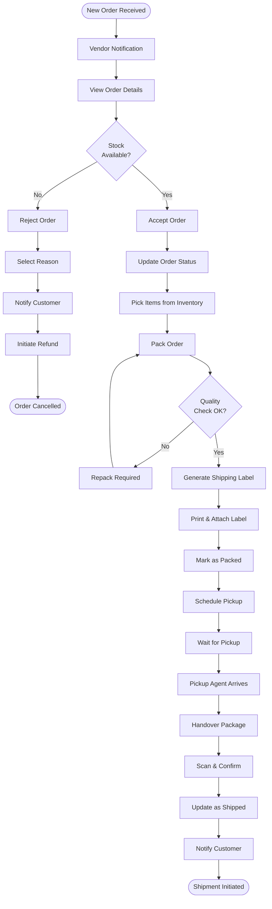
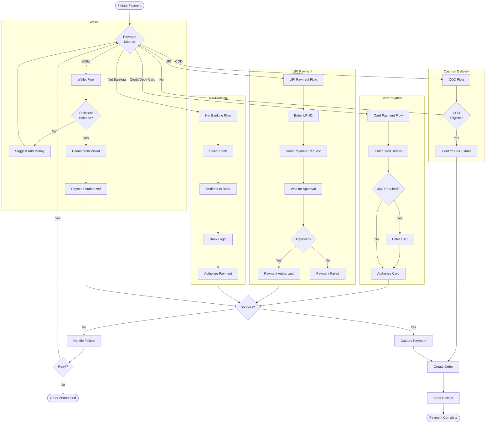
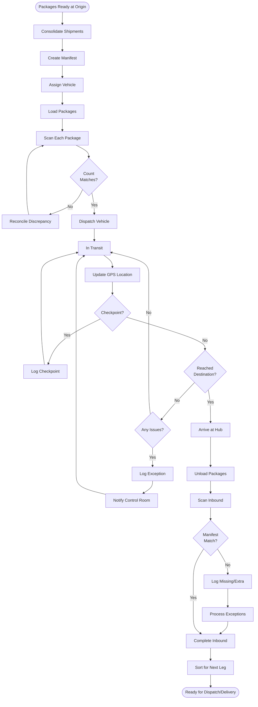
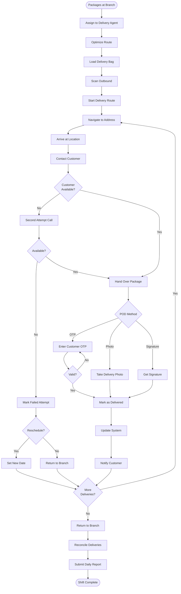
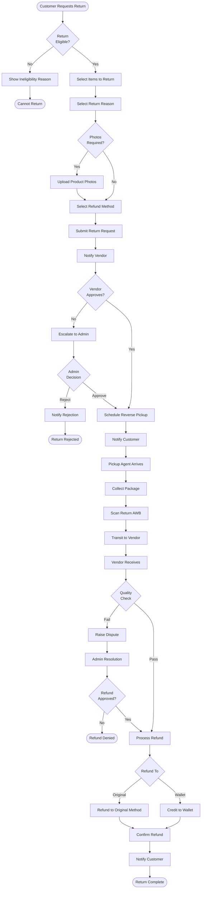

# Activity Diagrams

## Overview
Activity diagrams showing the business process flows for key operations in the e-commerce system.

---

## Order Placement Flow

```mermaid
flowchart TD
    Start([Customer opens app]) --> Browse[Browse Products]
    Browse --> Search{Search or<br>Category?}
    Search -->|Search| SearchResults[View Search Results]
    Search -->|Category| CategoryList[View Category Products]
    SearchResults --> SelectProduct[Select Product]
    CategoryList --> SelectProduct
    
    SelectProduct --> ViewDetails[View Product Details]
    ViewDetails --> CheckStock{In Stock?}
    CheckStock -->|No| Notify[Notify When Available]
    Notify --> Browse
    CheckStock -->|Yes| AddCart{Add to Cart?}
    AddCart -->|No| Browse
    AddCart -->|Yes| SelectVariant[Select Variant/Qty]
    SelectVariant --> AddToCart[Add to Cart]
    AddToCart --> Continue{Continue<br>Shopping?}
    Continue -->|Yes| Browse
    Continue -->|No| ViewCart[View Cart]
    
    ViewCart --> ValidateCart{Cart Valid?}
    ValidateCart -->|Items OOS| RemoveOOS[Remove OOS Items]
    RemoveOOS --> ViewCart
    ValidateCart -->|Valid| Checkout[Proceed to Checkout]
    
    Checkout --> LoggedIn{Logged In?}
    LoggedIn -->|No| Login[Login/Register]
    Login --> SelectAddress
    LoggedIn -->|Yes| SelectAddress[Select Delivery Address]
    
    SelectAddress --> HasAddress{Has Saved<br>Address?}
    HasAddress -->|No| AddAddress[Add New Address]
    AddAddress --> Serviceable
    HasAddress -->|Yes| ChooseAddress[Choose Address]
    ChooseAddress --> Serviceable{Serviceable?}
    Serviceable -->|No| AddAddress
    Serviceable -->|Yes| ApplyCoupon{Apply Coupon?}
    
    ApplyCoupon -->|Yes| EnterCoupon[Enter Coupon Code]
    EnterCoupon --> ValidCoupon{Valid?}
    ValidCoupon -->|No| ShowError[Show Error]
    ShowError --> ApplyCoupon
    ValidCoupon -->|Yes| SelectPayment
    ApplyCoupon -->|No| SelectPayment[Select Payment Method]
    
    SelectPayment --> ReviewOrder[Review Order Summary]
    ReviewOrder --> PlaceOrder[Place Order]
    PlaceOrder --> ProcessPayment{Payment<br>Method?}
    
    ProcessPayment -->|COD| CreateOrder[Create Order]
    ProcessPayment -->|Online| RedirectPG[Redirect to Gateway]
    RedirectPG --> PaymentComplete{Payment<br>Success?}
    PaymentComplete -->|No| PaymentFailed[Show Failure]
    PaymentFailed --> SelectPayment
    PaymentComplete -->|Yes| CreateOrder
    
    CreateOrder --> SplitOrder[Split by Vendor]
    SplitOrder --> NotifyVendors[Notify Vendors]
    NotifyVendors --> SendConfirmation[Send Confirmation]
    SendConfirmation --> ShowConfirmation[Show Order Confirmation]
    ShowConfirmation --> End([End])
```

---

## Order Fulfillment Flow (Vendor)

---

## Payment Processing Flow

---

## Line Haul Transit Flow

---

## Last Mile Delivery Flow

---

## Return & Refund Flow

