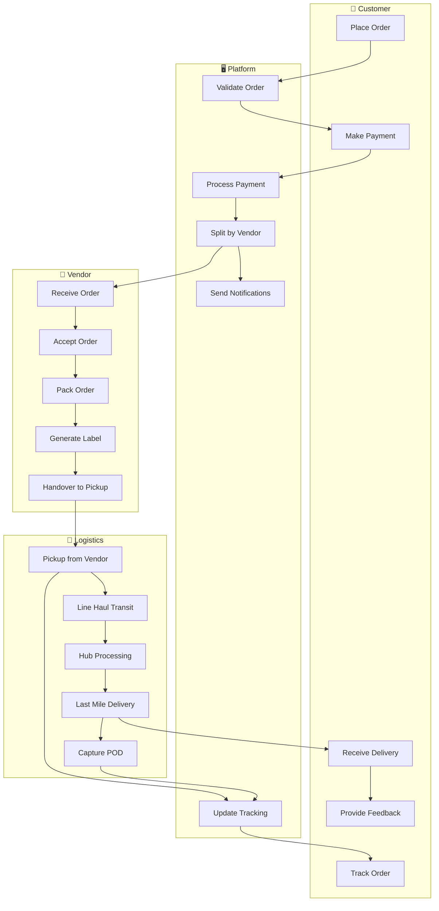
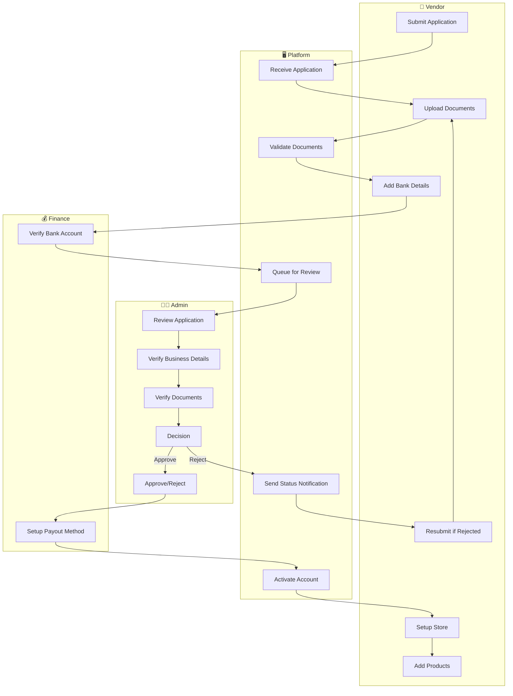
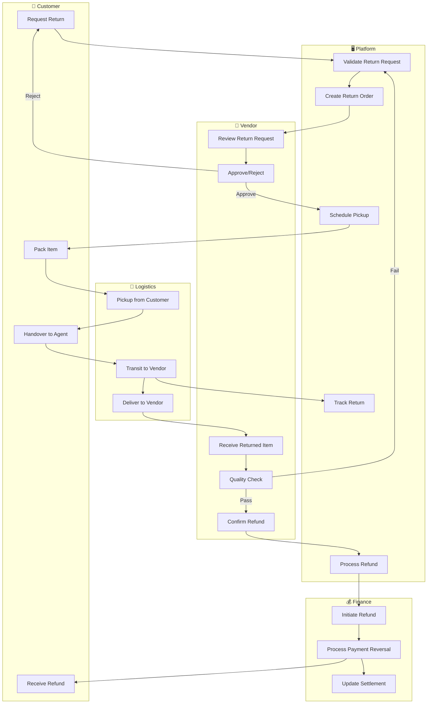
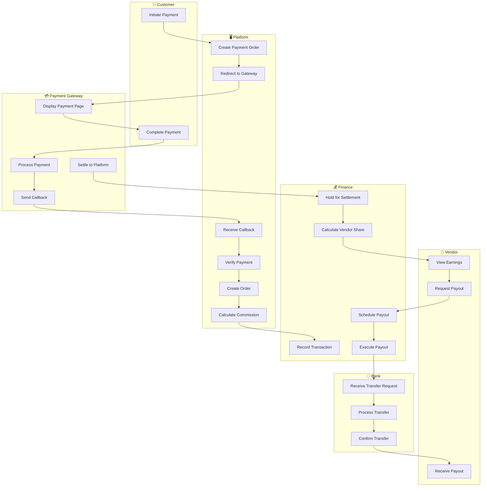
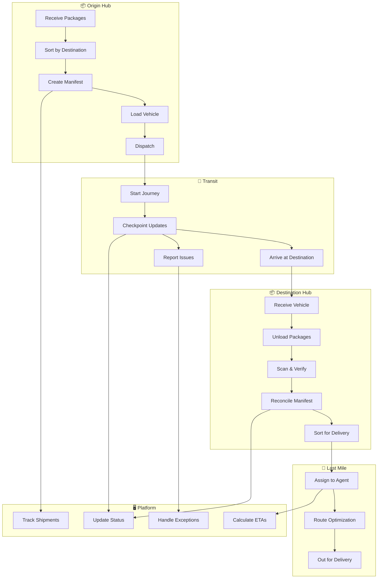
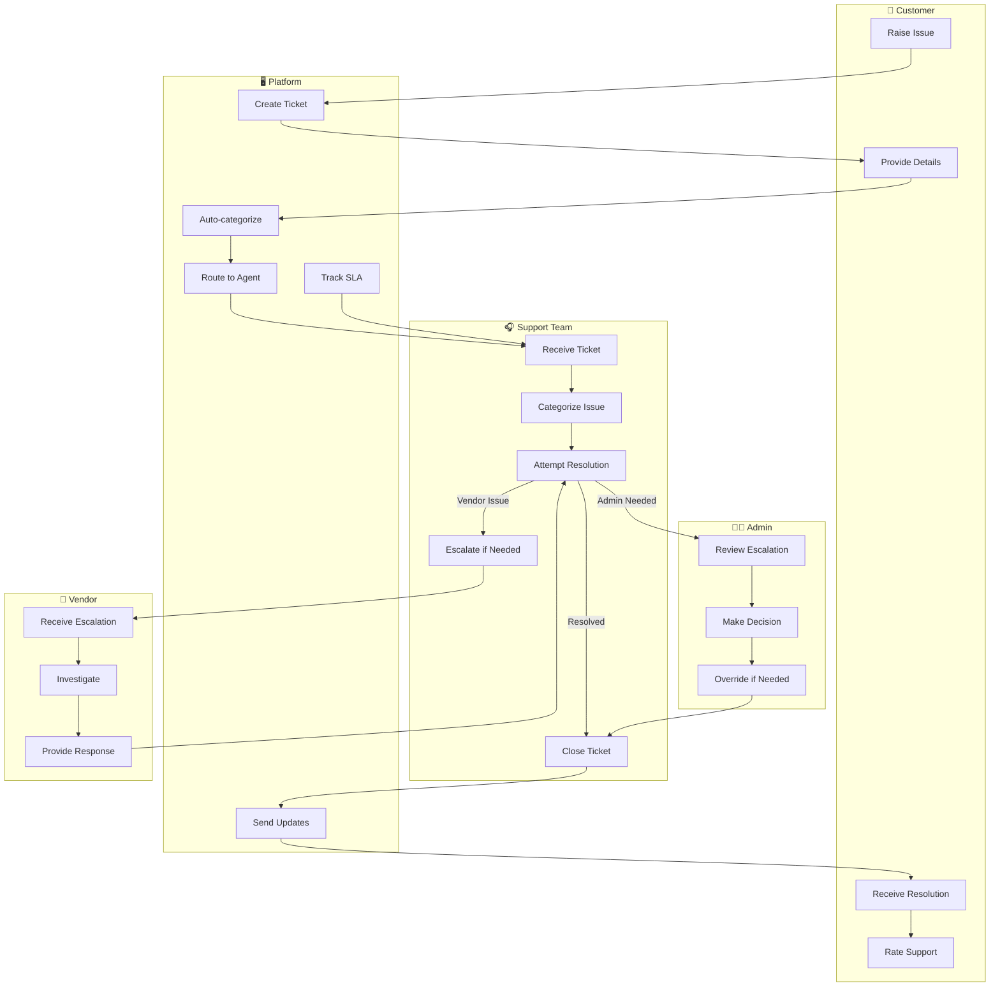
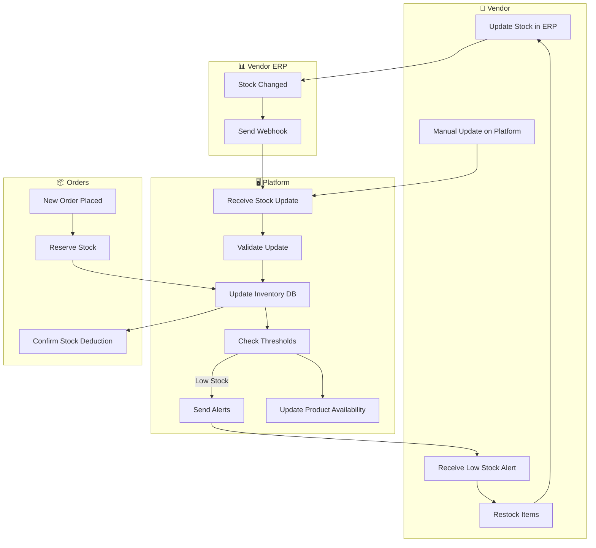

# Swimlane Diagrams (BPMN)

## Overview
Cross-department workflow diagrams showing responsibilities and handoffs between different actors and systems.

---

## Order-to-Delivery Workflow

---

## Vendor Onboarding Workflow

---

## Return Processing Workflow

---

## Payment & Settlement Workflow

---

## Line Haul Operations Workflow

---

## Customer Support Escalation Workflow

---

## Inventory Sync Workflow

