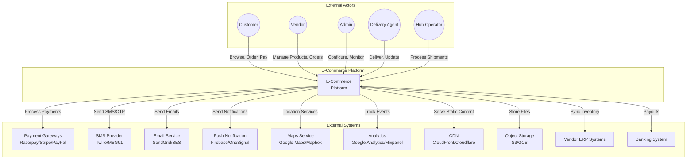
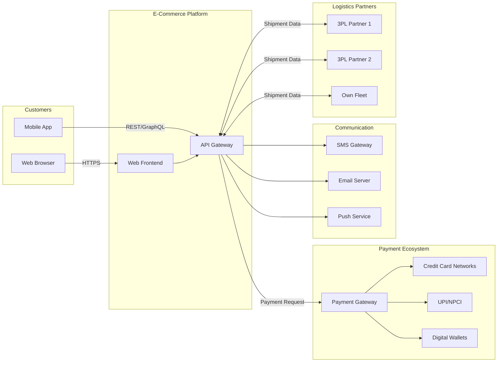
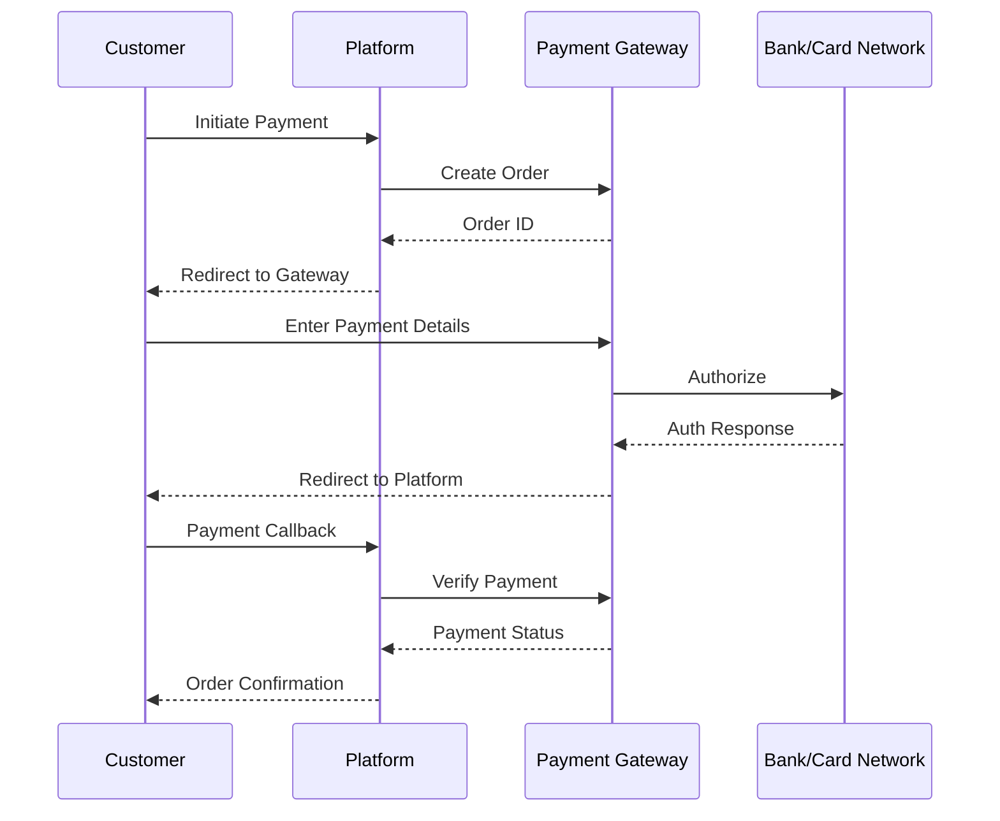
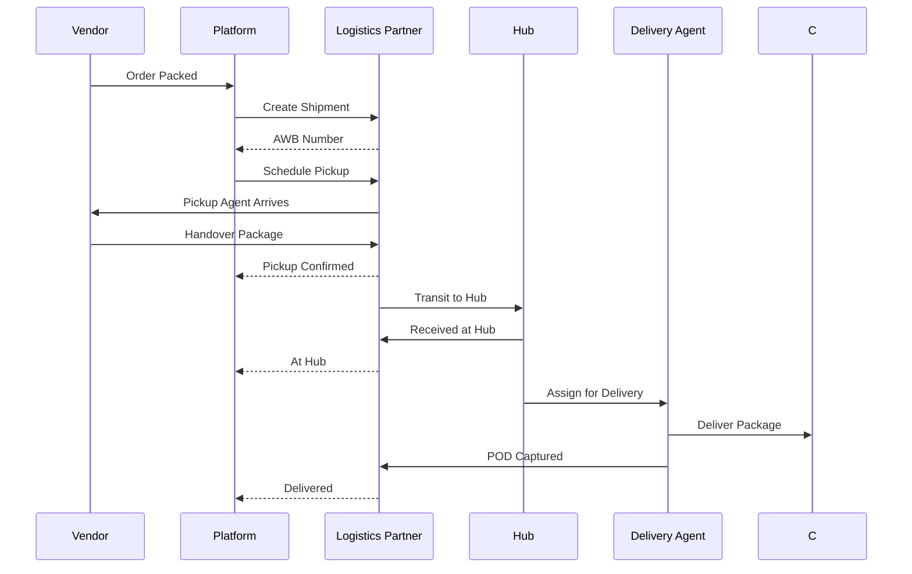
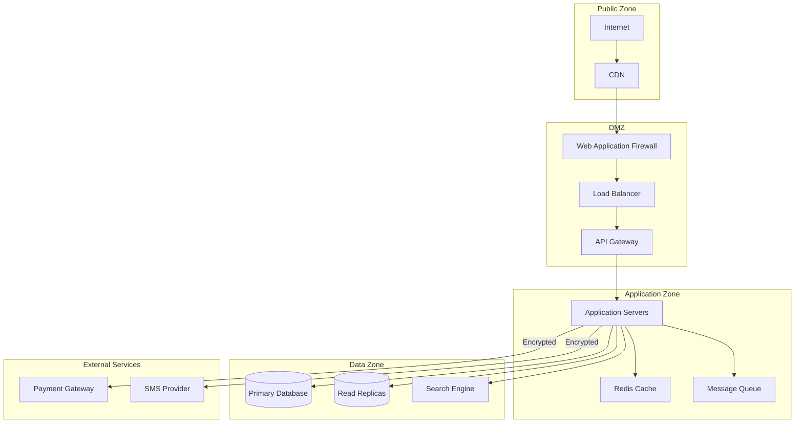

# System Context Diagram

## Overview
The System Context Diagram shows the e-commerce platform's boundaries and its interactions with external systems and actors.

---

## Main System Context Diagram

---

## Detailed Context with Data Flows

---

## Integration Points Detail

### Payment Gateway Integration

### Logistics Partner Integration

---

## External System Dependencies

| System | Purpose | Integration Type | Criticality |
|--------|---------|------------------|-------------|
| Payment Gateway | Process payments | REST API | Critical |
| SMS Provider | OTP, notifications | REST API | High |
| Email Service | Transactional emails | SMTP/API | High |
| Push Notification | Mobile/web push | SDK/API | Medium |
| Maps API | Address, routing | REST API | Medium |
| CDN | Static assets | HTTP | High |
| Object Storage | Images, files | SDK | High |
| Analytics | User tracking | JS SDK | Low |
| ERP Systems | Vendor inventory sync | API/Webhook | Medium |
| Banking | Vendor payouts | API | High |

---

## Security Boundaries

