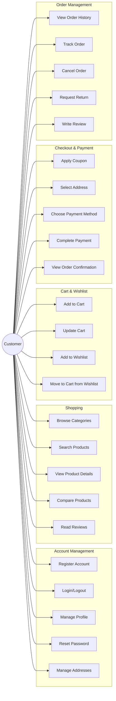
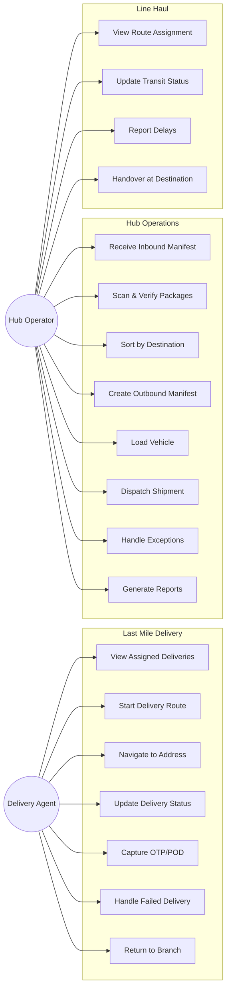
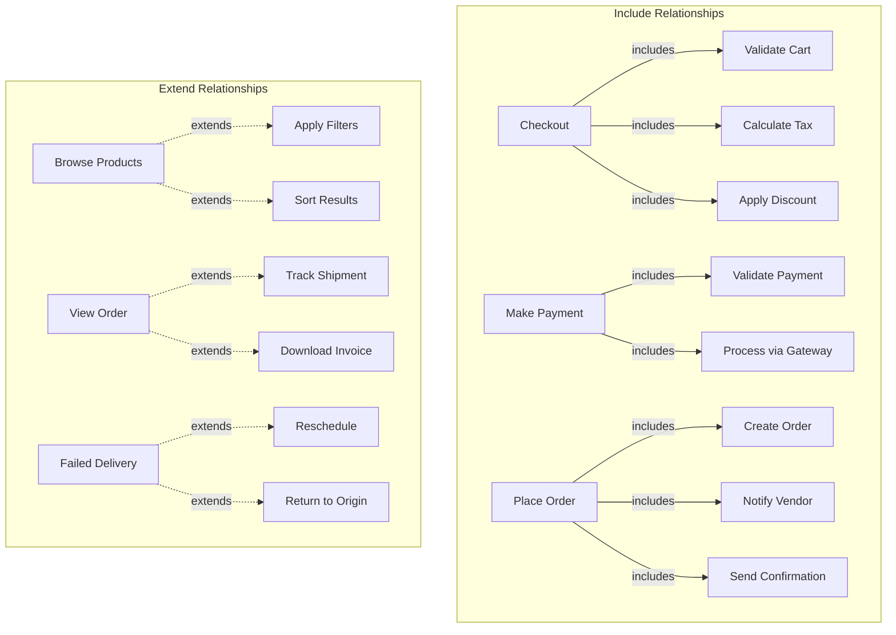

# Use Case Diagram

## Overview
This document contains use case diagrams for all major actors in the e-commerce system.

---

## Complete System Use Case Diagram

```mermaid
graph TB
    subgraph Actors
        Customer((Customer))
        Vendor((Vendor))
        Admin((Admin))
        DeliveryAgent((Delivery Agent))
        HubOperator((Hub Operator))
        PaymentGateway((Payment Gateway))
        SMSProvider((SMS Provider))
    end

    subgraph "E-Commerce Platform"
        UC1[Browse Products]
        UC2[Search Products]
        UC3[Manage Cart]
        UC4[Checkout]
        UC5[Make Payment]
        UC6[Track Order]
        UC7[Return/Refund]
        UC8[Manage Profile]
        
        UC10[Manage Products]
        UC11[Manage Inventory]
        UC12[Process Orders]
        UC13[View Analytics]
        UC14[Manage Payouts]
        
        UC20[Manage Users]
        UC21[Manage Vendors]
        UC22[Manage Categories]
        UC23[View Reports]
        UC24[Manage Logistics]
        
        UC30[Deliver Orders]
        UC31[Capture POD]
        UC32[Handle Exceptions]
        
        UC40[Receive Shipments]
        UC41[Sort Packages]
        UC42[Dispatch Shipments]
    end

    Customer --> UC1
    Customer --> UC2
    Customer --> UC3
    Customer --> UC4
    Customer --> UC5
    Customer --> UC6
    Customer --> UC7
    Customer --> UC8
    
    Vendor --> UC10
    Vendor --> UC11
    Vendor --> UC12
    Vendor --> UC13
    Vendor --> UC14
    
    Admin --> UC20
    Admin --> UC21
    Admin --> UC22
    Admin --> UC23
    Admin --> UC24
    
    DeliveryAgent --> UC30
    DeliveryAgent --> UC31
    DeliveryAgent --> UC32
    
    HubOperator --> UC40
    HubOperator --> UC41
    HubOperator --> UC42
    
    UC5 --> PaymentGateway
    UC4 --> SMSProvider
    UC6 --> SMSProvider
```

---

## Customer Use Cases

---

## Vendor Use Cases

```mermaid
graph LR
    Vendor((Vendor))
    
    subgraph "Onboarding"
        UC1[Register as Vendor]
        UC2[Submit Documents]
        UC3[Setup Store Profile]
        UC4[Configure Bank Account]
    end
    
    subgraph "Product Management"
        UC5[Add Product]
        UC6[Edit Product]
        UC7[Delete Product]
        UC8[Bulk Upload Products]
        UC9[Manage Variants]
        UC10[Set Pricing]
    end
    
    subgraph "Inventory"
        UC11[Update Stock]
        UC12[View Low Stock Alerts]
        UC13[Manage Warehouses]
    end
    
    subgraph "Order Fulfillment"
        UC14[View Incoming Orders]
        UC15[Accept/Reject Order]
        UC16[Mark as Packed]
        UC17[Generate Shipping Label]
        UC18[Schedule Pickup]
    end
    
    subgraph "Returns"
        UC19[View Return Requests]
        UC20[Accept/Reject Return]
        UC21[Process Refund]
    end
    
    subgraph "Finance"
        UC22[View Earnings]
        UC23[Request Payout]
        UC24[View Payout History]
        UC25[Download Invoices]
    end
    
    subgraph "Analytics"
        UC26[View Sales Dashboard]
        UC27[View Product Performance]
        UC28[View Customer Insights]
    end
    
    Vendor --> UC1
    Vendor --> UC2
    Vendor --> UC3
    Vendor --> UC4
    Vendor --> UC5
    Vendor --> UC6
    Vendor --> UC7
    Vendor --> UC8
    Vendor --> UC9
    Vendor --> UC10
    Vendor --> UC11
    Vendor --> UC12
    Vendor --> UC13
    Vendor --> UC14
    Vendor --> UC15
    Vendor --> UC16
    Vendor --> UC17
    Vendor --> UC18
    Vendor --> UC19
    Vendor --> UC20
    Vendor --> UC21
    Vendor --> UC22
    Vendor --> UC23
    Vendor --> UC24
    Vendor --> UC25
    Vendor --> UC26
    Vendor --> UC27
    Vendor --> UC28
```

---

## Admin Use Cases

```mermaid
graph LR
    Admin((Admin))
    
    subgraph "User Management"
        UC1[View Customers]
        UC2[Suspend/Ban Customer]
        UC3[View Customer Orders]
        UC4[Handle Support Tickets]
    end
    
    subgraph "Vendor Management"
        UC5[View Vendor Applications]
        UC6[Approve/Reject Vendor]
        UC7[Suspend Vendor]
        UC8[View Vendor Performance]
    end
    
    subgraph "Catalog Management"
        UC9[Manage Categories]
        UC10[Approve Products]
        UC11[Flag/Remove Products]
        UC12[Manage Attributes]
    end
    
    subgraph "Order Management"
        UC13[View All Orders]
        UC14[Handle Disputes]
        UC15[Process Refunds]
        UC16[Override Order Status]
    end
    
    subgraph "Promotions"
        UC17[Create Coupons]
        UC18[Manage Banners]
        UC19[Schedule Sales]
        UC20[Create Campaigns]
    end
    
    subgraph "Logistics"
        UC21[Manage Delivery Zones]
        UC22[Configure Shipping Rates]
        UC23[Manage Branches]
        UC24[View Logistics Dashboard]
    end
    
    subgraph "Finance"
        UC25[View Revenue Reports]
        UC26[Process Vendor Payouts]
        UC27[Manage Commissions]
        UC28[View Transactions]
    end
    
    subgraph "System"
        UC29[Manage Admin Roles]
        UC30[View Audit Logs]
        UC31[Configure Settings]
        UC32[Manage Integrations]
    end
    
    Admin --> UC1
    Admin --> UC2
    Admin --> UC3
    Admin --> UC4
    Admin --> UC5
    Admin --> UC6
    Admin --> UC7
    Admin --> UC8
    Admin --> UC9
    Admin --> UC10
    Admin --> UC11
    Admin --> UC12
    Admin --> UC13
    Admin --> UC14
    Admin --> UC15
    Admin --> UC16
    Admin --> UC17
    Admin --> UC18
    Admin --> UC19
    Admin --> UC20
    Admin --> UC21
    Admin --> UC22
    Admin --> UC23
    Admin --> UC24
    Admin --> UC25
    Admin --> UC26
    Admin --> UC27
    Admin --> UC28
    Admin --> UC29
    Admin --> UC30
    Admin --> UC31
    Admin --> UC32
```

---

## Delivery & Logistics Use Cases

---

## Use Case Relationships

