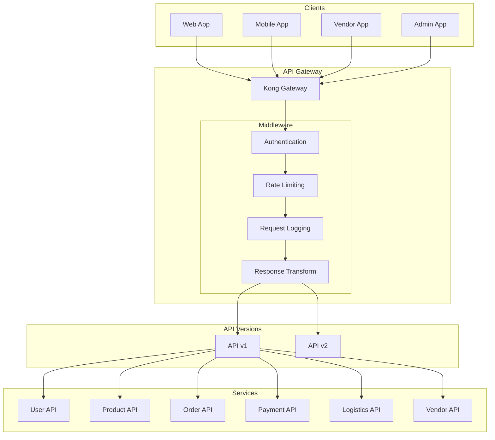
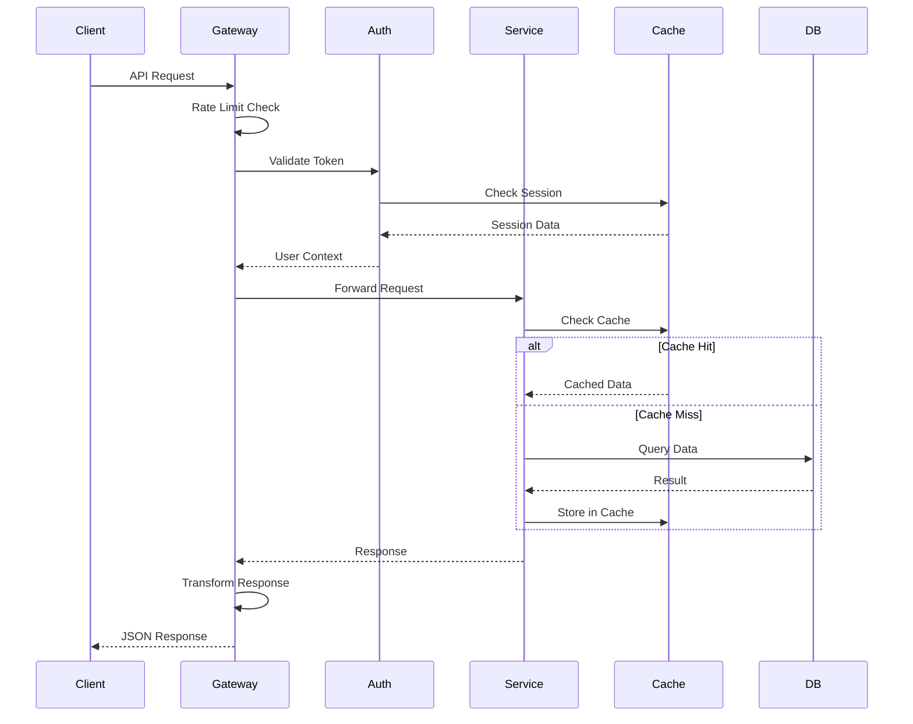

# API Design

## Overview
RESTful API design specifications for the e-commerce platform.

---

## API Architecture



---

## Authentication API

### Endpoints

| Method | Endpoint | Description |
|--------|----------|-------------|
| POST | `/auth/register` | Register new user |
| POST | `/auth/login` | Login with email/phone |
| POST | `/auth/logout` | Logout current session |
| POST | `/auth/refresh` | Refresh access token |
| POST | `/auth/forgot-password` | Request password reset |
| POST | `/auth/reset-password` | Reset password with token |
| POST | `/auth/verify-email` | Verify email with OTP |
| POST | `/auth/verify-phone` | Verify phone with OTP |
| POST | `/auth/oauth/{provider}` | OAuth login (google/facebook) |

### Request/Response Examples

#### Register User
```http
POST /api/v1/auth/register
Content-Type: application/json

{
  "email": "user@example.com",
  "phone": "+919876543210",
  "password": "SecurePass123!",
  "name": "John Doe"
}
```

**Response: 201 Created**
```json
{
  "success": true,
  "data": {
    "user": {
      "id": "uuid",
      "email": "user@example.com",
      "name": "John Doe",
      "emailVerified": false,
      "phoneVerified": false
    },
    "tokens": {
      "accessToken": "eyJhbG...",
      "refreshToken": "eyJhbG...",
      "expiresIn": 3600
    }
  }
}
```

#### Login
```http
POST /api/v1/auth/login
Content-Type: application/json

{
  "email": "user@example.com",
  "password": "SecurePass123!"
}
```

---

## Product API

### Endpoints

| Method | Endpoint | Description |
|--------|----------|-------------|
| GET | `/products` | List products with filters |
| GET | `/products/:id` | Get product details |
| GET | `/products/:id/reviews` | Get product reviews |
| GET | `/products/search` | Search products |
| GET | `/categories` | List categories |
| GET | `/categories/:id/products` | Products by category |
| GET | `/brands` | List brands |

### Query Parameters

| Parameter | Type | Description |
|-----------|------|-------------|
| `page` | integer | Page number (default: 1) |
| `limit` | integer | Items per page (default: 20, max: 100) |
| `sort` | string | Sort field (price, rating, newest) |
| `order` | string | Sort order (asc, desc) |
| `category` | uuid | Filter by category |
| `brand` | uuid | Filter by brand |
| `minPrice` | decimal | Minimum price |
| `maxPrice` | decimal | Maximum price |
| `rating` | integer | Minimum rating (1-5) |
| `inStock` | boolean | Only in-stock items |

### Request/Response Examples

#### List Products
```http
GET /api/v1/products?category=electronics&minPrice=100&maxPrice=1000&sort=price&order=asc&page=1&limit=20
```

**Response: 200 OK**
```json
{
  "success": true,
  "data": {
    "products": [
      {
        "id": "uuid",
        "name": "Wireless Headphones",
        "slug": "wireless-headphones",
        "shortDescription": "Premium wireless headphones",
        "images": [
          {
            "url": "https://cdn.example.com/images/1.jpg",
            "isPrimary": true
          }
        ],
        "price": {
          "mrp": 299.99,
          "sellingPrice": 249.99,
          "discount": 17
        },
        "rating": {
          "average": 4.5,
          "count": 128
        },
        "vendor": {
          "id": "uuid",
          "name": "TechStore",
          "rating": 4.8
        },
        "inStock": true
      }
    ],
    "pagination": {
      "page": 1,
      "limit": 20,
      "total": 156,
      "totalPages": 8
    }
  }
}
```

#### Get Product Details
```http
GET /api/v1/products/uuid
```

**Response: 200 OK**
```json
{
  "success": true,
  "data": {
    "id": "uuid",
    "name": "Wireless Headphones",
    "slug": "wireless-headphones",
    "description": "Full product description...",
    "specifications": {
      "Connectivity": "Bluetooth 5.0",
      "Battery Life": "30 hours",
      "Weight": "250g"
    },
    "variants": [
      {
        "id": "uuid",
        "sku": "WH-BLK-001",
        "name": "Black",
        "attributes": {
          "color": "Black"
        },
        "price": {
          "mrp": 299.99,
          "sellingPrice": 249.99
        },
        "stock": 45,
        "isDefault": true
      }
    ],
    "images": [...],
    "category": {...},
    "brand": {...},
    "vendor": {...},
    "rating": {...}
  }
}
```

---

## Cart API

### Endpoints

| Method | Endpoint | Description |
|--------|----------|-------------|
| GET | `/cart` | Get current cart |
| POST | `/cart/items` | Add item to cart |
| PUT | `/cart/items/:id` | Update cart item quantity |
| DELETE | `/cart/items/:id` | Remove item from cart |
| DELETE | `/cart` | Clear cart |
| POST | `/cart/coupon` | Apply coupon |
| DELETE | `/cart/coupon` | Remove coupon |

### Request/Response Examples

#### Add to Cart
```http
POST /api/v1/cart/items
Authorization: Bearer {token}
Content-Type: application/json

{
  "variantId": "uuid",
  "quantity": 2
}
```

**Response: 200 OK**
```json
{
  "success": true,
  "data": {
    "cart": {
      "id": "uuid",
      "items": [
        {
          "id": "uuid",
          "product": {
            "id": "uuid",
            "name": "Wireless Headphones",
            "image": "https://cdn.example.com/images/1.jpg"
          },
          "variant": {
            "id": "uuid",
            "name": "Black",
            "sku": "WH-BLK-001"
          },
          "quantity": 2,
          "unitPrice": 249.99,
          "totalPrice": 499.98,
          "inStock": true
        }
      ],
      "summary": {
        "subtotal": 499.98,
        "discount": 0,
        "shipping": 0,
        "tax": 89.99,
        "total": 589.97
      },
      "coupon": null
    }
  }
}
```

---

## Order API

### Endpoints

| Method | Endpoint | Description |
|--------|----------|-------------|
| GET | `/orders` | List user orders |
| GET | `/orders/:id` | Get order details |
| POST | `/orders` | Create order (checkout) |
| POST | `/orders/:id/cancel` | Cancel order |
| GET | `/orders/:id/track` | Track order |
| POST | `/orders/:id/return` | Request return |
| GET | `/orders/:id/invoice` | Download invoice |

### Request/Response Examples

#### Create Order (Checkout)
```http
POST /api/v1/orders
Authorization: Bearer {token}
Content-Type: application/json

{
  "addressId": "uuid",
  "paymentMethod": "card",
  "couponCode": "SAVE10",
  "notes": "Please leave at door"
}
```

**Response: 201 Created**
```json
{
  "success": true,
  "data": {
    "order": {
      "id": "uuid",
      "orderNumber": "ORD-2024-000123",
      "status": "pending",
      "items": [...],
      "address": {...},
      "summary": {
        "subtotal": 499.98,
        "discount": 49.99,
        "shipping": 0,
        "tax": 80.99,
        "total": 530.98
      },
      "createdAt": "2024-01-15T10:30:00Z"
    },
    "payment": {
      "orderId": "order_xxx",
      "amount": 53098,
      "currency": "INR",
      "paymentUrl": "https://razorpay.com/pay/xxx"
    }
  }
}
```

#### Track Order
```http
GET /api/v1/orders/uuid/track
Authorization: Bearer {token}
```

**Response: 200 OK**
```json
{
  "success": true,
  "data": {
    "orderNumber": "ORD-2024-000123",
    "status": "in_transit",
    "estimatedDelivery": "2024-01-18",
    "shipments": [
      {
        "awb": "AWB123456",
        "status": "in_transit",
        "currentLocation": "Mumbai Hub",
        "tracking": [
          {
            "status": "Order Placed",
            "location": "Online",
            "timestamp": "2024-01-15T10:30:00Z"
          },
          {
            "status": "Picked Up",
            "location": "Vendor Warehouse",
            "timestamp": "2024-01-16T09:00:00Z"
          },
          {
            "status": "In Transit",
            "location": "Mumbai Hub",
            "timestamp": "2024-01-17T14:30:00Z"
          }
        ]
      }
    ]
  }
}
```

---

## Payment API

### Endpoints

| Method | Endpoint | Description |
|--------|----------|-------------|
| POST | `/payments/create` | Create payment order |
| POST | `/payments/verify` | Verify payment |
| GET | `/payments/:id` | Get payment status |
| POST | `/payments/webhooks/:gateway` | Payment gateway webhook |

### Webhook Payload (Razorpay)
```json
{
  "entity": "event",
  "event": "payment.captured",
  "payload": {
    "payment": {
      "entity": {
        "id": "pay_xxx",
        "order_id": "order_xxx",
        "amount": 53098,
        "currency": "INR",
        "status": "captured"
      }
    }
  }
}
```

---

## Vendor API

### Endpoints

| Method | Endpoint | Description |
|--------|----------|-------------|
| GET | `/vendor/dashboard` | Dashboard metrics |
| GET | `/vendor/products` | List vendor products |
| POST | `/vendor/products` | Create product |
| PUT | `/vendor/products/:id` | Update product |
| DELETE | `/vendor/products/:id` | Delete product |
| GET | `/vendor/orders` | List vendor orders |
| POST | `/vendor/orders/:id/accept` | Accept order |
| POST | `/vendor/orders/:id/reject` | Reject order |
| POST | `/vendor/orders/:id/pack` | Mark as packed |
| GET | `/vendor/payouts` | List payouts |
| POST | `/vendor/payouts/request` | Request payout |

---

## Admin API

### Endpoints

| Method | Endpoint | Description |
|--------|----------|-------------|
| GET | `/admin/dashboard` | Admin dashboard |
| GET | `/admin/users` | List users |
| GET | `/admin/vendors` | List vendors |
| POST | `/admin/vendors/:id/approve` | Approve vendor |
| POST | `/admin/vendors/:id/reject` | Reject vendor |
| GET | `/admin/orders` | List all orders |
| GET | `/admin/categories` | Manage categories |
| POST | `/admin/categories` | Create category |
| GET | `/admin/analytics` | Analytics data |

---

## Error Response Format

```json
{
  "success": false,
  "error": {
    "code": "VALIDATION_ERROR",
    "message": "Invalid input data",
    "details": [
      {
        "field": "email",
        "message": "Invalid email format"
      }
    ]
  },
  "requestId": "req_xxx"
}
```

### Error Codes

| Code | HTTP Status | Description |
|------|-------------|-------------|
| `VALIDATION_ERROR` | 400 | Invalid request data |
| `UNAUTHORIZED` | 401 | Authentication required |
| `FORBIDDEN` | 403 | Permission denied |
| `NOT_FOUND` | 404 | Resource not found |
| `CONFLICT` | 409 | Resource already exists |
| `RATE_LIMITED` | 429 | Too many requests |
| `INTERNAL_ERROR` | 500 | Server error |

---

## Rate Limiting

| Tier | Requests/min | Description |
|------|--------------|-------------|
| Public | 60 | Unauthenticated requests |
| Customer | 120 | Authenticated customers |
| Vendor | 300 | Vendor dashboard |
| Admin | 600 | Admin panel |

### Rate Limit Headers
```http
X-RateLimit-Limit: 120
X-RateLimit-Remaining: 95
X-RateLimit-Reset: 1705320000
```

---

## API Integration Diagram


