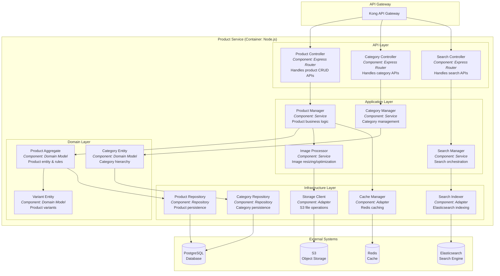
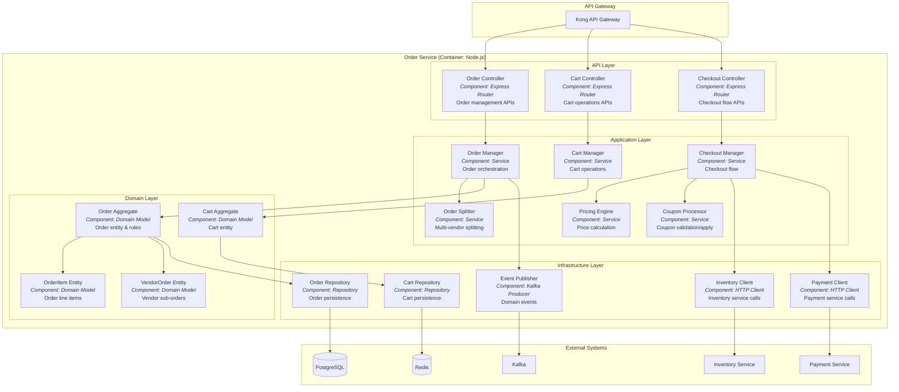
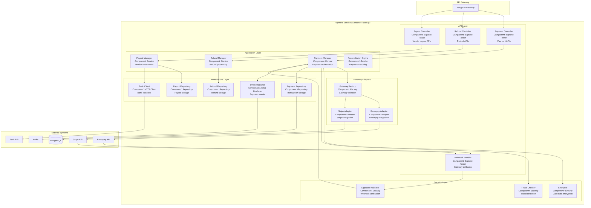
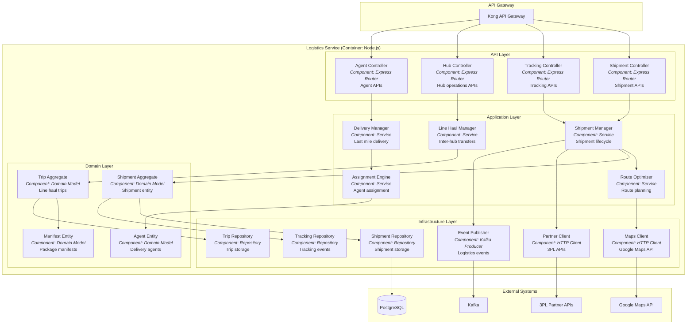
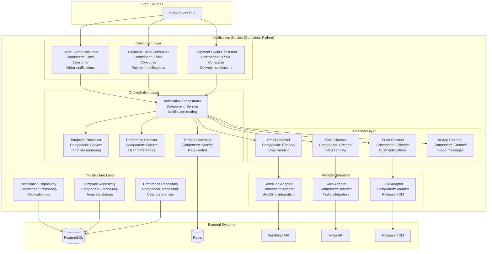

# C4 Component Diagram

## Overview
Detailed C4 Component diagrams for key services showing internal structure at the component level.

---

## Product Service - Component Diagram

---

## Order Service - Component Diagram

---

## Payment Service - Component Diagram

---

## Logistics Service - Component Diagram

---

## Notification Service - Component Diagram

---

## Component Summary Table

| Service | Components | Responsibilities |
|---------|------------|------------------|
| **Product Service** | Controller, Manager, Repository, Indexer, Cache | Product CRUD, search, caching |
| **Order Service** | Controller, Manager, Splitter, Pricing, Publisher | Order lifecycle, multi-vendor |
| **Payment Service** | Controller, Manager, Gateway Adapters, Security | Payment processing, refunds |
| **Logistics Service** | Controller, Manager, Optimizer, Assignment | Shipment, tracking, delivery |
| **Notification Service** | Consumers, Orchestrator, Channels, Adapters | Multi-channel notifications |
