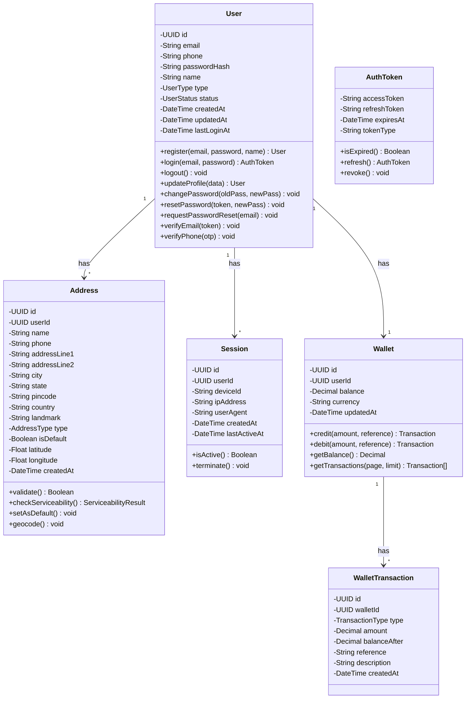
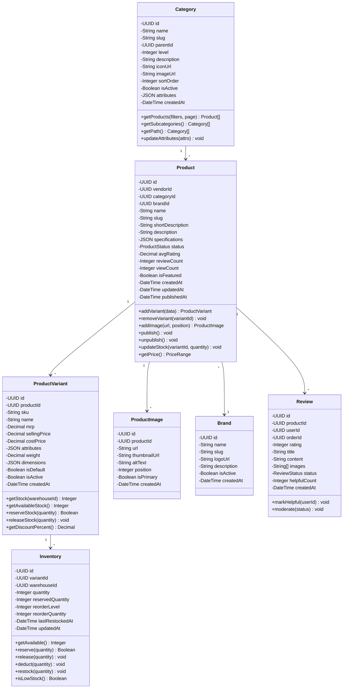
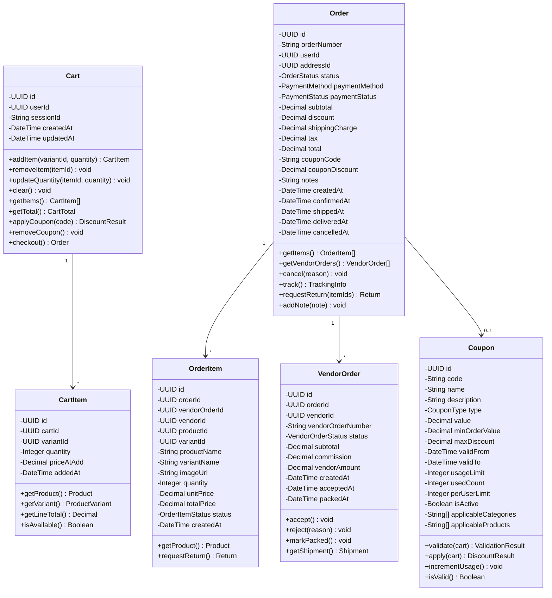
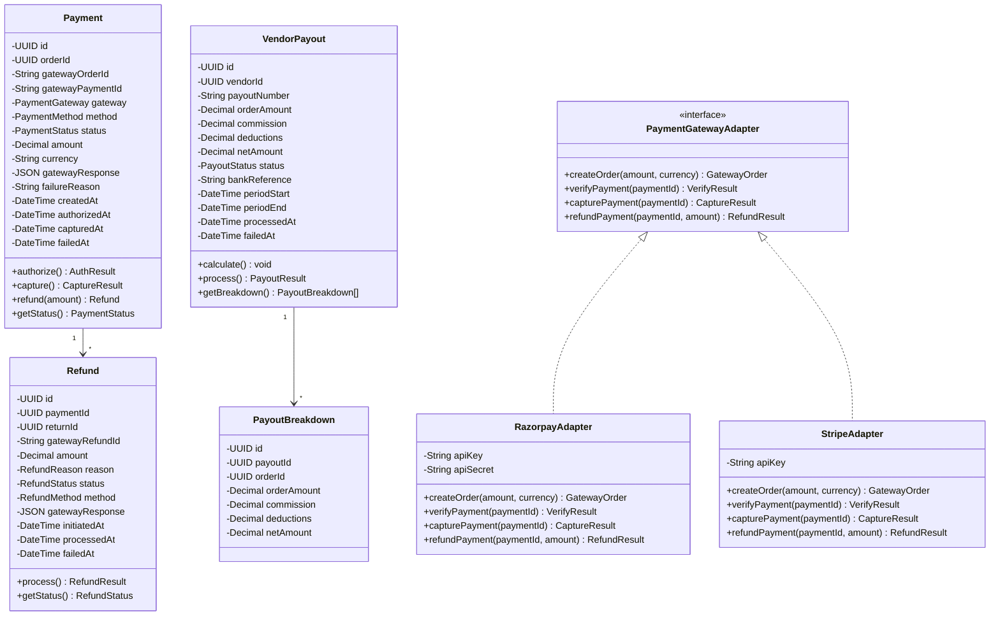
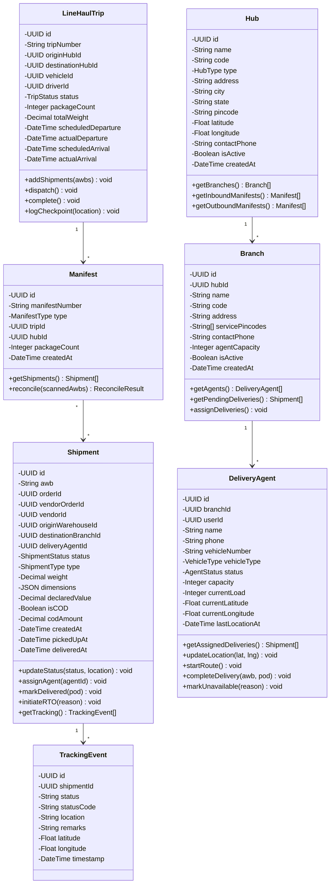
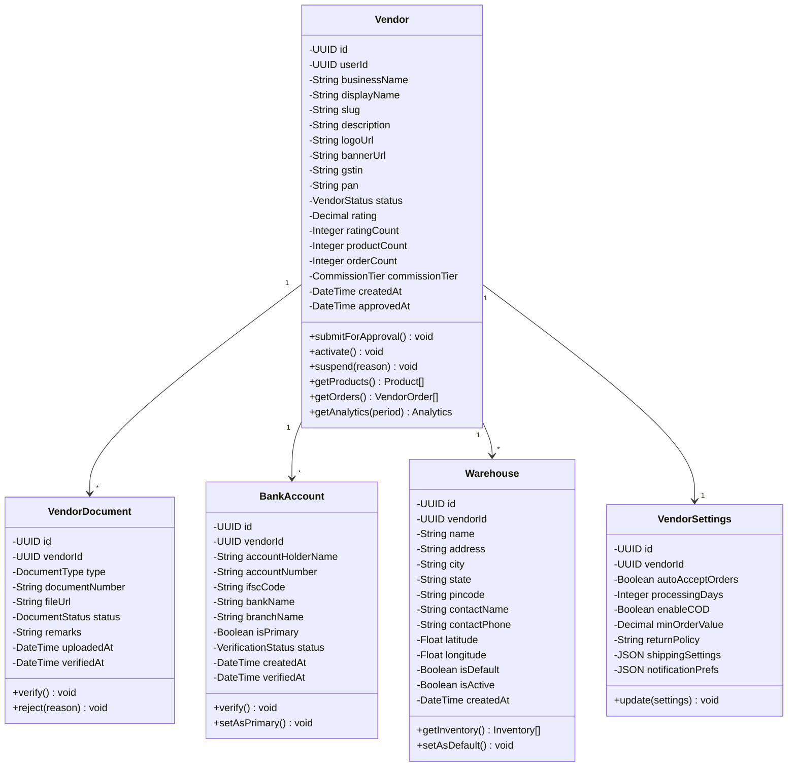

# Class Diagrams

## Overview
Detailed class diagrams showing classes, methods, attributes, and relationships for key components.

---

## User Domain Classes

---

## Product Domain Classes

---

## Order Domain Classes

---

## Payment Domain Classes

---

## Logistics Domain Classes

---

## Vendor Domain Classes

