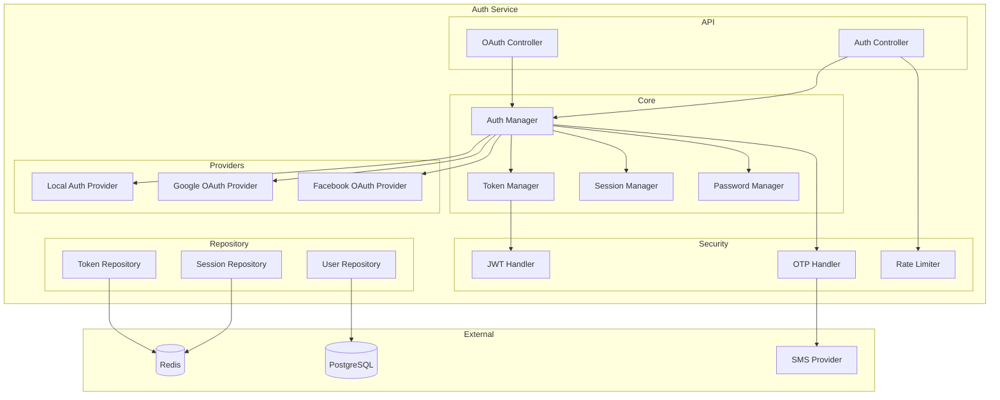
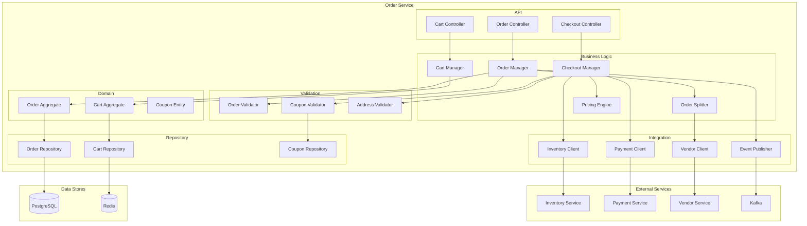
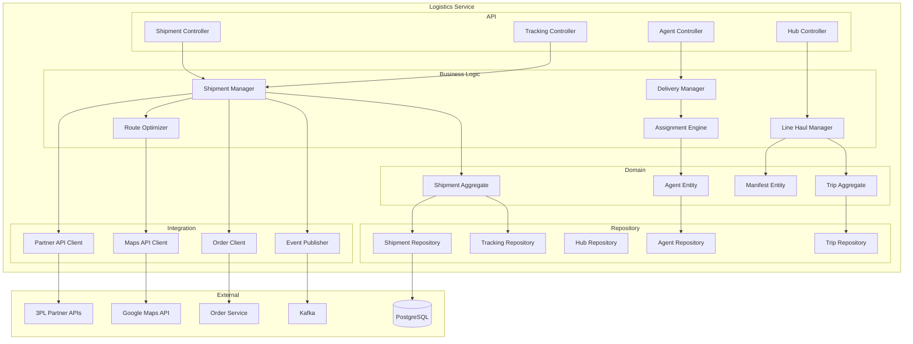
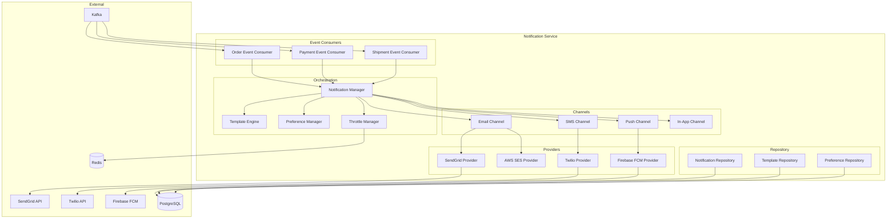

# Component Diagrams

## Overview
Component diagrams showing the software module breakdown and dependencies.

---

## System Component Overview

```mermaid
graph TB
    subgraph "Client Layer"
        CustomerWeb[Customer Web App]
        VendorWeb[Vendor Portal]
        AdminWeb[Admin Dashboard]
        AgentMobile[Agent Mobile App]
    end
    
    subgraph "API Gateway Layer"
        Gateway[Kong API Gateway]
    end
    
    subgraph "Service Layer"
        subgraph "User Services"
            AuthSvc[Auth Service]
            UserSvc[User Service]
        end
        
        subgraph "Catalog Services"
            ProductSvc[Product Service]
            InventorySvc[Inventory Service]
            SearchSvc[Search Service]
        end
        
        subgraph "Order Services"
            CartSvc[Cart Service]
            OrderSvc[Order Service]
            CheckoutSvc[Checkout Service]
        end
        
        subgraph "Payment Services"
            PaymentSvc[Payment Service]
            RefundSvc[Refund Service]
            PayoutSvc[Payout Service]
        end
        
        subgraph "Logistics Services"
            ShipmentSvc[Shipment Service]
            RouteSvc[Route Service]
            TrackingSvc[Tracking Service]
            LineHaulSvc[Line Haul Service]
        end
        
        subgraph "Vendor Services"
            VendorMgmtSvc[Vendor Management]
            VendorOrderSvc[Vendor Order Service]
        end
        
        subgraph "Support Services"
            NotificationSvc[Notification Service]
            AnalyticsSvc[Analytics Service]
            MediaSvc[Media Service]
        end
    end
    
    subgraph "Data Layer"
        PostgreSQL[(PostgreSQL)]
        Redis[(Redis)]
        Elasticsearch[(Elasticsearch)]
        S3[(S3)]
        Kafka[Kafka]
    end
    
    CustomerWeb --> Gateway
    VendorWeb --> Gateway
    AdminWeb --> Gateway
    AgentMobile --> Gateway
    
    Gateway --> AuthSvc
    Gateway --> UserSvc
    Gateway --> ProductSvc
    Gateway --> CartSvc
    Gateway --> OrderSvc
    Gateway --> PaymentSvc
    Gateway --> ShipmentSvc
    Gateway --> VendorMgmtSvc
    
    AuthSvc --> UserSvc
    ProductSvc --> InventorySvc
    ProductSvc --> SearchSvc
    OrderSvc --> CartSvc
    OrderSvc --> CheckoutSvc
    CheckoutSvc --> PaymentSvc
    CheckoutSvc --> InventorySvc
    PaymentSvc --> RefundSvc
    VendorMgmtSvc --> PayoutSvc
    ShipmentSvc --> RouteSvc
    ShipmentSvc --> TrackingSvc
    ShipmentSvc --> LineHaulSvc
    VendorMgmtSvc --> VendorOrderSvc
    
    UserSvc --> PostgreSQL
    UserSvc --> Redis
    ProductSvc --> PostgreSQL
    ProductSvc --> Elasticsearch
    ProductSvc --> S3
    InventorySvc --> PostgreSQL
    InventorySvc --> Redis
    CartSvc --> Redis
    OrderSvc --> PostgreSQL
    OrderSvc --> Kafka
    PaymentSvc --> PostgreSQL
    PaymentSvc --> Kafka
    ShipmentSvc --> PostgreSQL
    ShipmentSvc --> Kafka
    NotificationSvc --> Kafka
    AnalyticsSvc --> PostgreSQL
```

---

## Auth Service Components

---

## Order Service Components

---

## Payment Service Components

```mermaid
graph TB
    subgraph "Payment Service"
        subgraph "API"
            PaymentController[Payment Controller]
            WebhookController[Webhook Controller]
            RefundController[Refund Controller]
            PayoutController[Payout Controller]
        end
        
        subgraph "Business Logic"
            PaymentManager[Payment Manager]
            RefundManager[Refund Manager]
            PayoutManager[Payout Manager]
            ReconciliationEngine[Reconciliation Engine]
        end
        
        subgraph "Gateway Adapters"
            GatewayFactory[Gateway Factory]
            RazorpayAdapter[Razorpay Adapter]
            StripeAdapter[Stripe Adapter]
            PayPalAdapter[PayPal Adapter]
        end
        
        subgraph "Security"
            SignatureVerifier[Signature Verifier]
            EncryptionHandler[Encryption Handler]
            FraudDetector[Fraud Detector]
        end
        
        subgraph "Repository"
            PaymentRepo[Payment Repository]
            RefundRepo[Refund Repository]
            PayoutRepo[Payout Repository]
            LedgerRepo[Ledger Repository]
        end
        
        subgraph "Integration"
            OrderClient[Order Client]
            VendorClient[Vendor Client]
            BankClient[Bank Client]
            EventPublisher[Event Publisher]
        end
    end
    
    subgraph "External"
        Razorpay[Razorpay API]
        Stripe[Stripe API]
        PayPal[PayPal API]
        Bank[Bank API]
        Kafka[Kafka]
        PostgreSQL[(PostgreSQL)]
    end
    
    PaymentController --> PaymentManager
    WebhookController --> PaymentManager
    RefundController --> RefundManager
    PayoutController --> PayoutManager
    
    PaymentManager --> GatewayFactory
    RefundManager --> GatewayFactory
    
    GatewayFactory --> RazorpayAdapter
    GatewayFactory --> StripeAdapter
    GatewayFactory --> PayPalAdapter
    
    WebhookController --> SignatureVerifier
    PaymentManager --> EncryptionHandler
    PaymentManager --> FraudDetector
    
    PaymentManager --> PaymentRepo
    RefundManager --> RefundRepo
    PayoutManager --> PayoutRepo
    ReconciliationEngine --> LedgerRepo
    
    PaymentManager --> OrderClient
    PayoutManager --> VendorClient
    PayoutManager --> BankClient
    PaymentManager --> EventPublisher
    
    RazorpayAdapter --> Razorpay
    StripeAdapter --> Stripe
    PayPalAdapter --> PayPal
    BankClient --> Bank
    EventPublisher --> Kafka
    
    PaymentRepo --> PostgreSQL
    RefundRepo --> PostgreSQL
    PayoutRepo --> PostgreSQL
```

---

## Logistics Service Components

---

## Notification Service Components

---

## Component Dependencies Matrix

| Component | Depends On | Depended By |
|-----------|------------|-------------|
| Auth Service | User Service, Redis | All Services |
| User Service | PostgreSQL, Redis | Auth, Order, Vendor |
| Product Service | PostgreSQL, Elasticsearch, S3 | Search, Cart, Order |
| Inventory Service | PostgreSQL, Redis | Product, Order, Checkout |
| Cart Service | Redis | Order, Checkout |
| Order Service | PostgreSQL, Kafka | Payment, Shipment, Notification |
| Payment Service | PostgreSQL, Kafka, Gateways | Order, Refund |
| Shipment Service | PostgreSQL, Kafka, Maps | Order, Notification |
| Notification Service | Kafka, Email/SMS/Push | - |
| Analytics Service | PostgreSQL, Kafka | - |
