# ERD / Database Schema

## Overview
Entity-Relationship Diagrams and database schema design for the e-commerce system.

---

## Complete ERD

```mermaid
erDiagram
    users {
        uuid id PK
        varchar email UK
        varchar phone UK
        varchar password_hash
        varchar name
        varchar avatar_url
        enum user_type
        enum status
        boolean email_verified
        boolean phone_verified
        timestamp created_at
        timestamp updated_at
        timestamp last_login_at
    }
    
    addresses {
        uuid id PK
        uuid user_id FK
        varchar name
        varchar phone
        varchar line1
        varchar line2
        varchar city
        varchar state
        varchar pincode
        varchar country
        varchar landmark
        enum type
        boolean is_default
        decimal latitude
        decimal longitude
        timestamp created_at
    }
    
    vendors {
        uuid id PK
        uuid user_id FK
        varchar business_name
        varchar display_name
        varchar slug UK
        text description
        varchar logo_url
        varchar banner_url
        varchar gstin
        varchar pan
        enum status
        decimal rating
        int rating_count
        int product_count
        enum commission_tier
        timestamp created_at
        timestamp approved_at
    }
    
    vendor_documents {
        uuid id PK
        uuid vendor_id FK
        enum doc_type
        varchar doc_number
        varchar file_url
        enum status
        text remarks
        timestamp uploaded_at
        timestamp verified_at
    }
    
    bank_accounts {
        uuid id PK
        uuid vendor_id FK
        varchar account_name
        varchar account_number
        varchar ifsc_code
        varchar bank_name
        boolean is_primary
        enum verification_status
        timestamp created_at
    }
    
    warehouses {
        uuid id PK
        uuid vendor_id FK
        varchar name
        varchar address
        varchar city
        varchar state
        varchar pincode
        varchar contact_phone
        decimal latitude
        decimal longitude
        boolean is_default
        boolean is_active
        timestamp created_at
    }
    
    categories {
        uuid id PK
        uuid parent_id FK
        varchar name
        varchar slug UK
        int level
        text description
        varchar icon_url
        varchar image_url
        int sort_order
        boolean is_active
        jsonb attributes
        timestamp created_at
    }
    
    brands {
        uuid id PK
        varchar name
        varchar slug UK
        varchar logo_url
        text description
        boolean is_active
        timestamp created_at
    }
    
    products {
        uuid id PK
        uuid vendor_id FK
        uuid category_id FK
        uuid brand_id FK
        varchar name
        varchar slug UK
        text short_description
        text description
        jsonb specifications
        enum status
        decimal avg_rating
        int review_count
        int view_count
        boolean is_featured
        jsonb seo_data
        timestamp created_at
        timestamp updated_at
        timestamp published_at
    }
    
    product_variants {
        uuid id PK
        uuid product_id FK
        varchar sku UK
        varchar name
        decimal mrp
        decimal selling_price
        decimal cost_price
        jsonb attributes
        decimal weight
        jsonb dimensions
        boolean is_default
        boolean is_active
        timestamp created_at
    }
    
    product_images {
        uuid id PK
        uuid product_id FK
        varchar url
        varchar thumbnail_url
        varchar alt_text
        int position
        boolean is_primary
        timestamp created_at
    }
    
    inventory {
        uuid id PK
        uuid variant_id FK
        uuid warehouse_id FK
        int quantity
        int reserved_qty
        int reorder_level
        int reorder_qty
        timestamp last_restocked_at
        timestamp updated_at
    }
    
    carts {
        uuid id PK
        uuid user_id FK
        varchar session_id
        uuid coupon_id FK
        timestamp created_at
        timestamp updated_at
    }
    
    cart_items {
        uuid id PK
        uuid cart_id FK
        uuid variant_id FK
        int quantity
        decimal price_at_add
        timestamp added_at
    }
    
    orders {
        uuid id PK
        varchar order_number UK
        uuid user_id FK
        uuid address_id FK
        uuid coupon_id FK
        enum status
        enum payment_method
        enum payment_status
        decimal subtotal
        decimal discount
        decimal shipping_charge
        decimal tax
        decimal total
        varchar coupon_code
        decimal coupon_discount
        text notes
        varchar ip_address
        timestamp created_at
        timestamp confirmed_at
        timestamp shipped_at
        timestamp delivered_at
        timestamp cancelled_at
    }
    
    order_items {
        uuid id PK
        uuid order_id FK
        uuid vendor_order_id FK
        uuid vendor_id FK
        uuid product_id FK
        uuid variant_id FK
        varchar product_name
        varchar variant_name
        varchar image_url
        int quantity
        decimal unit_price
        decimal total_price
        enum status
        timestamp created_at
    }
    
    vendor_orders {
        uuid id PK
        uuid order_id FK
        uuid vendor_id FK
        varchar vendor_order_number UK
        enum status
        decimal subtotal
        decimal commission
        decimal vendor_amount
        timestamp created_at
        timestamp accepted_at
        timestamp packed_at
    }
    
    payments {
        uuid id PK
        uuid order_id FK
        varchar gateway_order_id
        varchar gateway_payment_id
        enum gateway
        enum method
        enum status
        decimal amount
        varchar currency
        jsonb gateway_response
        text failure_reason
        timestamp created_at
        timestamp authorized_at
        timestamp captured_at
    }
    
    refunds {
        uuid id PK
        uuid payment_id FK
        uuid return_id FK
        varchar gateway_refund_id
        decimal amount
        enum reason
        enum status
        enum method
        jsonb gateway_response
        timestamp initiated_at
        timestamp processed_at
    }
    
    shipments {
        uuid id PK
        varchar awb UK
        uuid order_id FK
        uuid vendor_order_id FK
        uuid vendor_id FK
        uuid warehouse_id FK
        uuid branch_id FK
        uuid agent_id FK
        enum status
        enum type
        decimal weight
        jsonb dimensions
        decimal declared_value
        boolean is_cod
        decimal cod_amount
        timestamp created_at
        timestamp picked_up_at
        timestamp delivered_at
    }
    
    shipment_tracking {
        uuid id PK
        uuid shipment_id FK
        varchar status
        varchar status_code
        varchar location
        text remarks
        decimal latitude
        decimal longitude
        timestamp timestamp
    }
    
    hubs {
        uuid id PK
        varchar name
        varchar code UK
        enum type
        varchar address
        varchar city
        varchar state
        varchar pincode
        decimal latitude
        decimal longitude
        varchar contact_phone
        boolean is_active
        timestamp created_at
    }
    
    branches {
        uuid id PK
        uuid hub_id FK
        varchar name
        varchar code UK
        varchar address
        varchar[] service_pincodes
        varchar contact_phone
        int agent_capacity
        boolean is_active
        timestamp created_at
    }
    
    delivery_agents {
        uuid id PK
        uuid branch_id FK
        uuid user_id FK
        varchar vehicle_number
        enum vehicle_type
        enum status
        int capacity
        int current_load
        decimal current_lat
        decimal current_lng
        timestamp last_location_at
        timestamp created_at
    }
    
    line_haul_trips {
        uuid id PK
        varchar trip_number UK
        uuid origin_hub_id FK
        uuid dest_hub_id FK
        uuid vehicle_id FK
        uuid driver_id FK
        enum status
        int package_count
        decimal total_weight
        timestamp scheduled_departure
        timestamp actual_departure
        timestamp scheduled_arrival
        timestamp actual_arrival
        timestamp created_at
    }
    
    returns {
        uuid id PK
        varchar return_number UK
        uuid order_id FK
        uuid order_item_id FK
        uuid user_id FK
        uuid vendor_id FK
        enum status
        enum reason
        text reason_text
        varchar[] images
        enum refund_method
        decimal refund_amount
        uuid reverse_shipment_id FK
        timestamp created_at
        timestamp approved_at
        timestamp completed_at
    }
    
    reviews {
        uuid id PK
        uuid product_id FK
        uuid user_id FK
        uuid order_id FK
        int rating
        varchar title
        text content
        varchar[] images
        enum status
        int helpful_count
        timestamp created_at
    }

    users ||--o{ addresses : has
    users ||--o| vendors : extends
    users ||--o{ orders : places
    users ||--o{ reviews : writes
    
    vendors ||--o{ vendor_documents : has
    vendors ||--o{ bank_accounts : has
    vendors ||--o{ warehouses : has
    vendors ||--o{ products : sells
    vendors ||--o{ vendor_orders : receives
    
    categories ||--o{ categories : has_subcategories
    categories ||--o{ products : contains
    
    brands ||--o{ products : has
    
    products ||--o{ product_variants : has
    products ||--o{ product_images : has
    products ||--o{ reviews : has
    
    product_variants ||--o{ inventory : tracked_in
    product_variants ||--o{ cart_items : referenced_in
    product_variants ||--o{ order_items : ordered_in
    
    warehouses ||--o{ inventory : stores
    
    carts ||--o{ cart_items : contains
    
    orders ||--o{ order_items : contains
    orders ||--o{ vendor_orders : splits_into
    orders ||--|{ payments : has
    orders ||--o{ shipments : ships_via
    orders ||--o{ returns : may_have
    
    vendor_orders ||--o{ order_items : contains
    vendor_orders ||--o| shipments : ships_via
    
    payments ||--o{ refunds : may_have
    
    hubs ||--o{ branches : contains
    hubs ||--o{ line_haul_trips : origin_of
    hubs ||--o{ line_haul_trips : dest_of
    
    branches ||--o{ delivery_agents : employs
    branches ||--o{ shipments : handles
    
    delivery_agents ||--o{ shipments : delivers
    
    shipments ||--o{ shipment_tracking : tracks
    
    returns ||--o| refunds : triggers
```



---

## Table Specifications

### Core Tables

#### users
```sql
CREATE TABLE users (
    id UUID PRIMARY KEY DEFAULT gen_random_uuid(),
    email VARCHAR(255) UNIQUE,
    phone VARCHAR(20) UNIQUE,
    password_hash VARCHAR(255) NOT NULL,
    name VARCHAR(255) NOT NULL,
    avatar_url VARCHAR(500),
    user_type VARCHAR(20) NOT NULL DEFAULT 'customer',
    status VARCHAR(20) NOT NULL DEFAULT 'active',
    email_verified BOOLEAN DEFAULT FALSE,
    phone_verified BOOLEAN DEFAULT FALSE,
    created_at TIMESTAMP DEFAULT CURRENT_TIMESTAMP,
    updated_at TIMESTAMP DEFAULT CURRENT_TIMESTAMP,
    last_login_at TIMESTAMP,
    
    CONSTRAINT chk_user_type CHECK (user_type IN ('customer', 'vendor', 'admin', 'agent', 'hub_operator')),
    CONSTRAINT chk_status CHECK (status IN ('active', 'inactive', 'suspended', 'deleted'))
);

CREATE INDEX idx_users_email ON users(email);
CREATE INDEX idx_users_phone ON users(phone);
CREATE INDEX idx_users_type_status ON users(user_type, status);
```

#### products
```sql
CREATE TABLE products (
    id UUID PRIMARY KEY DEFAULT gen_random_uuid(),
    vendor_id UUID NOT NULL REFERENCES vendors(id),
    category_id UUID NOT NULL REFERENCES categories(id),
    brand_id UUID REFERENCES brands(id),
    name VARCHAR(255) NOT NULL,
    slug VARCHAR(300) UNIQUE NOT NULL,
    short_description TEXT,
    description TEXT,
    specifications JSONB DEFAULT '{}',
    status VARCHAR(20) NOT NULL DEFAULT 'draft',
    avg_rating DECIMAL(3,2) DEFAULT 0,
    review_count INTEGER DEFAULT 0,
    view_count INTEGER DEFAULT 0,
    is_featured BOOLEAN DEFAULT FALSE,
    seo_data JSONB DEFAULT '{}',
    created_at TIMESTAMP DEFAULT CURRENT_TIMESTAMP,
    updated_at TIMESTAMP DEFAULT CURRENT_TIMESTAMP,
    published_at TIMESTAMP,
    
    CONSTRAINT chk_product_status CHECK (status IN ('draft', 'pending', 'active', 'inactive', 'deleted'))
);

CREATE INDEX idx_products_vendor ON products(vendor_id);
CREATE INDEX idx_products_category ON products(category_id);
CREATE INDEX idx_products_status ON products(status);
CREATE INDEX idx_products_featured ON products(is_featured) WHERE is_featured = TRUE;
CREATE INDEX idx_products_search ON products USING gin(to_tsvector('english', name || ' ' || COALESCE(description, '')));
```

#### orders
```sql
CREATE TABLE orders (
    id UUID PRIMARY KEY DEFAULT gen_random_uuid(),
    order_number VARCHAR(20) UNIQUE NOT NULL,
    user_id UUID NOT NULL REFERENCES users(id),
    address_id UUID NOT NULL REFERENCES addresses(id),
    coupon_id UUID REFERENCES coupons(id),
    status VARCHAR(30) NOT NULL DEFAULT 'pending',
    payment_method VARCHAR(20) NOT NULL,
    payment_status VARCHAR(20) NOT NULL DEFAULT 'pending',
    subtotal DECIMAL(12,2) NOT NULL,
    discount DECIMAL(12,2) DEFAULT 0,
    shipping_charge DECIMAL(10,2) DEFAULT 0,
    tax DECIMAL(10,2) DEFAULT 0,
    total DECIMAL(12,2) NOT NULL,
    coupon_code VARCHAR(50),
    coupon_discount DECIMAL(10,2) DEFAULT 0,
    notes TEXT,
    ip_address INET,
    created_at TIMESTAMP DEFAULT CURRENT_TIMESTAMP,
    confirmed_at TIMESTAMP,
    shipped_at TIMESTAMP,
    delivered_at TIMESTAMP,
    cancelled_at TIMESTAMP,
    
    CONSTRAINT chk_order_status CHECK (status IN (
        'pending', 'confirmed', 'processing', 'packed', 'shipped',
        'in_transit', 'out_for_delivery', 'delivered', 'cancelled',
        'return_requested', 'returned'
    )),
    CONSTRAINT chk_payment_method CHECK (payment_method IN ('card', 'upi', 'netbanking', 'wallet', 'cod')),
    CONSTRAINT chk_payment_status CHECK (payment_status IN ('pending', 'authorized', 'captured', 'failed', 'refunded'))
);

CREATE INDEX idx_orders_user ON orders(user_id);
CREATE INDEX idx_orders_status ON orders(status);
CREATE INDEX idx_orders_created ON orders(created_at DESC);
CREATE INDEX idx_orders_number ON orders(order_number);
```

#### shipments
```sql
CREATE TABLE shipments (
    id UUID PRIMARY KEY DEFAULT gen_random_uuid(),
    awb VARCHAR(50) UNIQUE NOT NULL,
    order_id UUID NOT NULL REFERENCES orders(id),
    vendor_order_id UUID REFERENCES vendor_orders(id),
    vendor_id UUID NOT NULL REFERENCES vendors(id),
    warehouse_id UUID REFERENCES warehouses(id),
    branch_id UUID REFERENCES branches(id),
    agent_id UUID REFERENCES delivery_agents(id),
    status VARCHAR(30) NOT NULL DEFAULT 'created',
    type VARCHAR(20) NOT NULL DEFAULT 'forward',
    weight DECIMAL(10,3),
    dimensions JSONB,
    declared_value DECIMAL(12,2),
    is_cod BOOLEAN DEFAULT FALSE,
    cod_amount DECIMAL(12,2),
    created_at TIMESTAMP DEFAULT CURRENT_TIMESTAMP,
    picked_up_at TIMESTAMP,
    delivered_at TIMESTAMP,
    
    CONSTRAINT chk_shipment_status CHECK (status IN (
        'created', 'awaiting_pickup', 'picked_up', 'in_transit',
        'at_hub', 'out_for_delivery', 'delivered', 'delivery_failed',
        'rto_initiated', 'rto_in_transit', 'rto_delivered', 'cancelled'
    )),
    CONSTRAINT chk_shipment_type CHECK (type IN ('forward', 'reverse', 'rto'))
);

CREATE INDEX idx_shipments_awb ON shipments(awb);
CREATE INDEX idx_shipments_order ON shipments(order_id);
CREATE INDEX idx_shipments_status ON shipments(status);
CREATE INDEX idx_shipments_branch ON shipments(branch_id);
CREATE INDEX idx_shipments_agent ON shipments(agent_id);
```

---

## Indexes Strategy

| Table | Index | Columns | Purpose |
|-------|-------|---------|---------|
| users | Primary | id | Unique identifier |
| users | Unique | email, phone | Login lookups |
| products | B-Tree | vendor_id, status | Vendor product listing |
| products | GIN | name, description | Full-text search |
| orders | B-Tree | user_id, created_at | Order history |
| orders | B-Tree | status | Status filtering |
| shipments | B-Tree | awb | AWB lookups |
| shipments | B-Tree | agent_id, status | Agent assignments |
| inventory | B-Tree | variant_id, warehouse_id | Stock checks |

---

## Partitioning Strategy

```sql
-- Orders partitioned by month
CREATE TABLE orders (
    -- columns
) PARTITION BY RANGE (created_at);

CREATE TABLE orders_2024_01 PARTITION OF orders
    FOR VALUES FROM ('2024-01-01') TO ('2024-02-01');
    
CREATE TABLE orders_2024_02 PARTITION OF orders
    FOR VALUES FROM ('2024-02-01') TO ('2024-03-01');
-- Continue for each month

-- Shipment tracking partitioned by month
CREATE TABLE shipment_tracking (
    -- columns
) PARTITION BY RANGE (timestamp);
```
