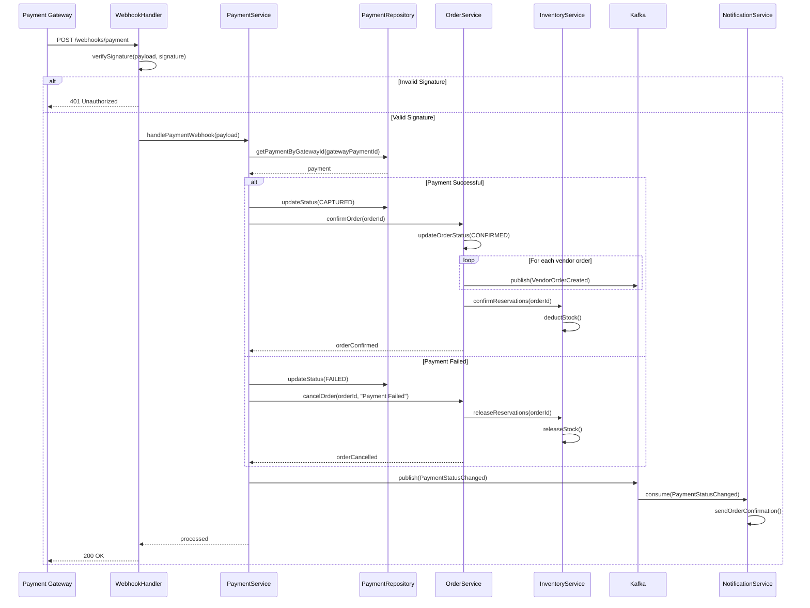
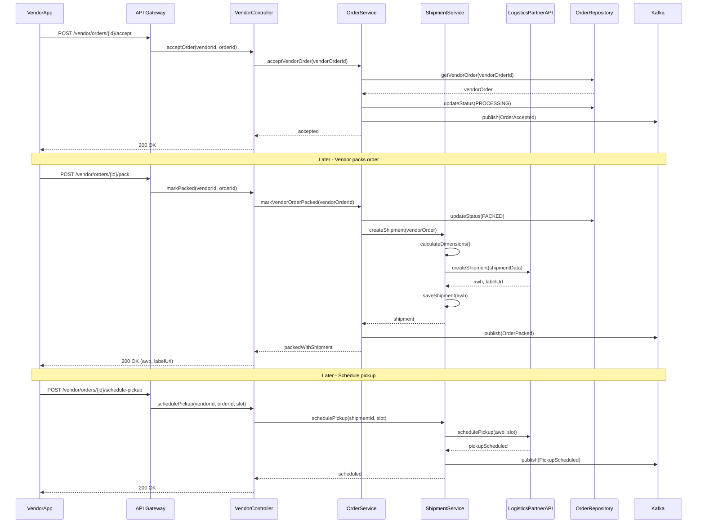

# Sequence Diagrams

## Overview
Detailed sequence diagrams showing internal object interactions for key system operations.

---

## Place Order - Internal Sequence

---

## Payment Processing - Internal Sequence

---

## Vendor Order Fulfillment - Internal Sequence

---

## Last Mile Delivery - Internal Sequence

---

## Line Haul Transit - Internal Sequence

---

## Return Processing - Internal Sequence

