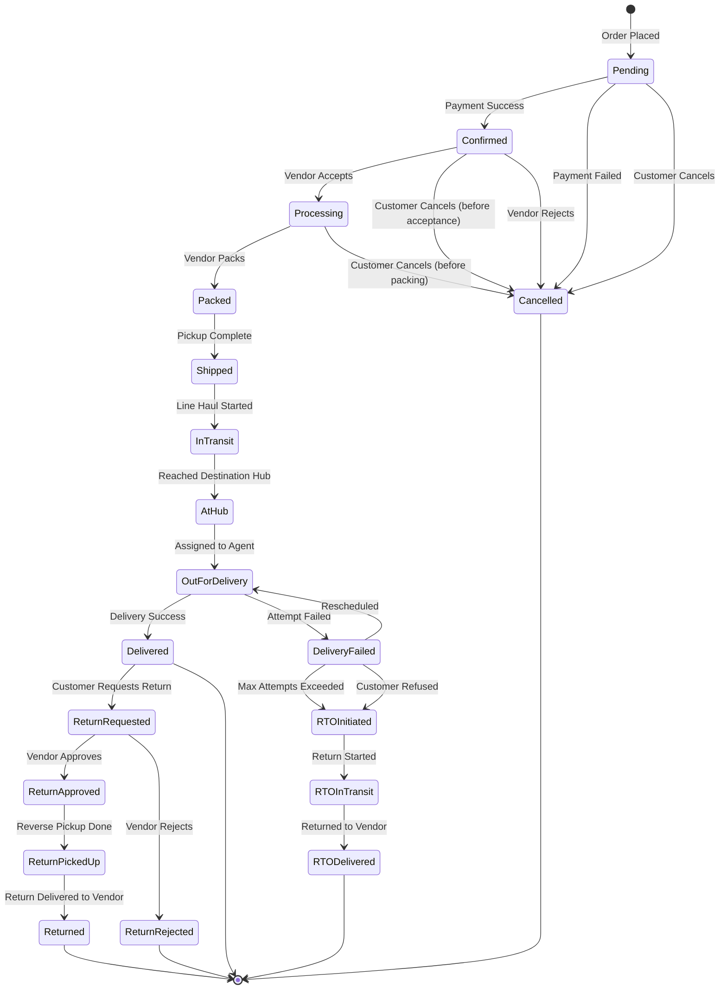
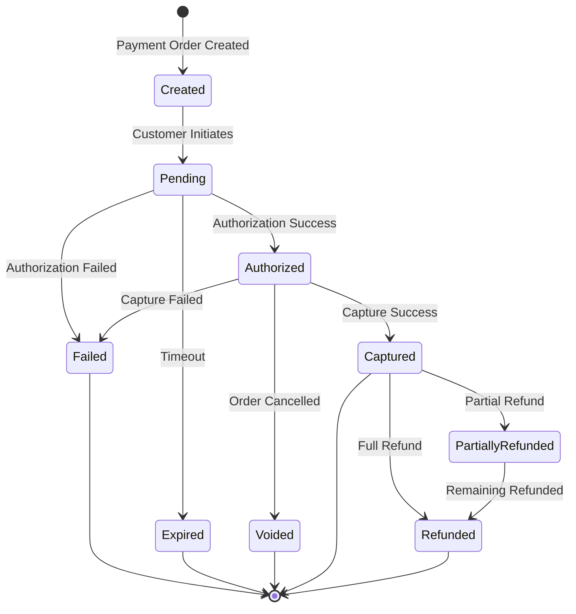
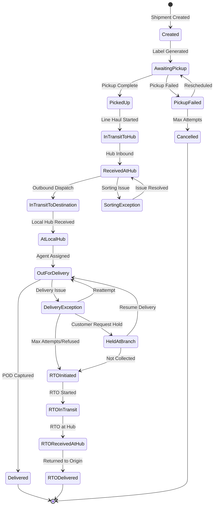
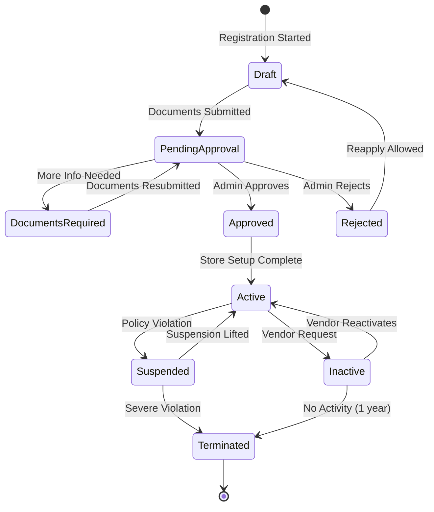
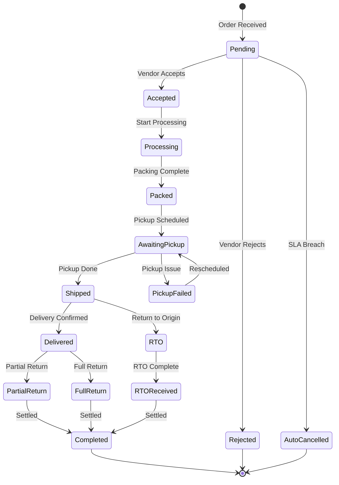
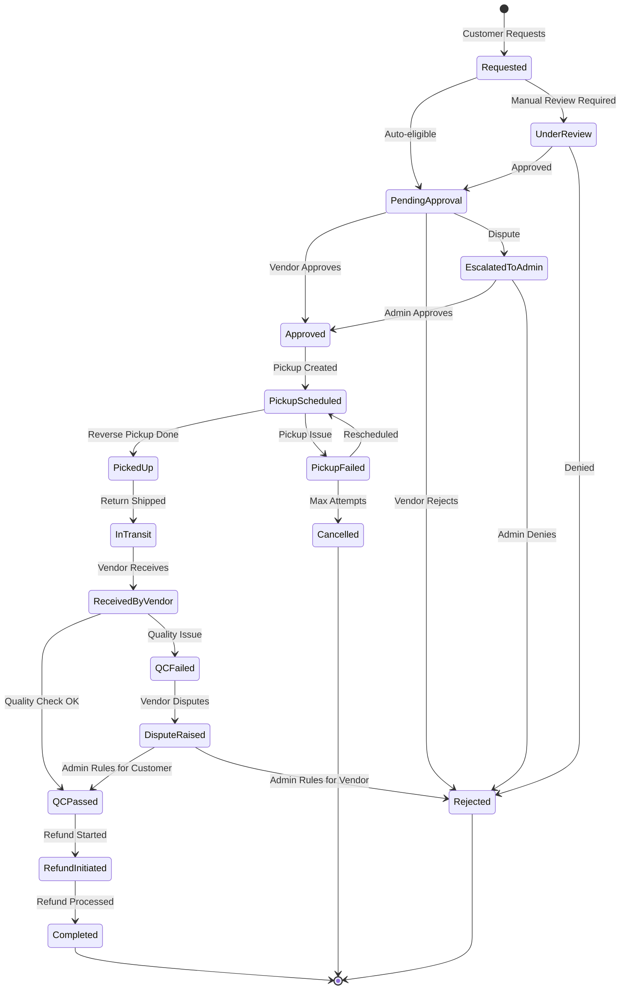
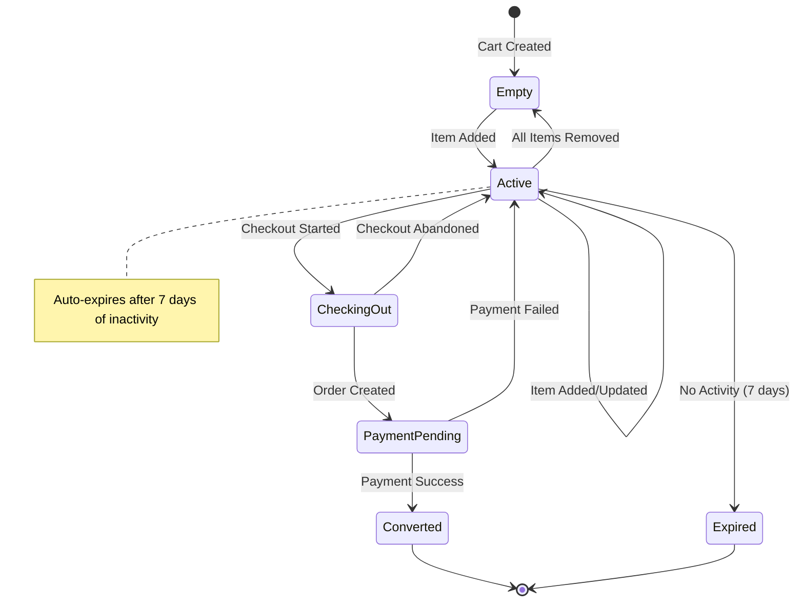
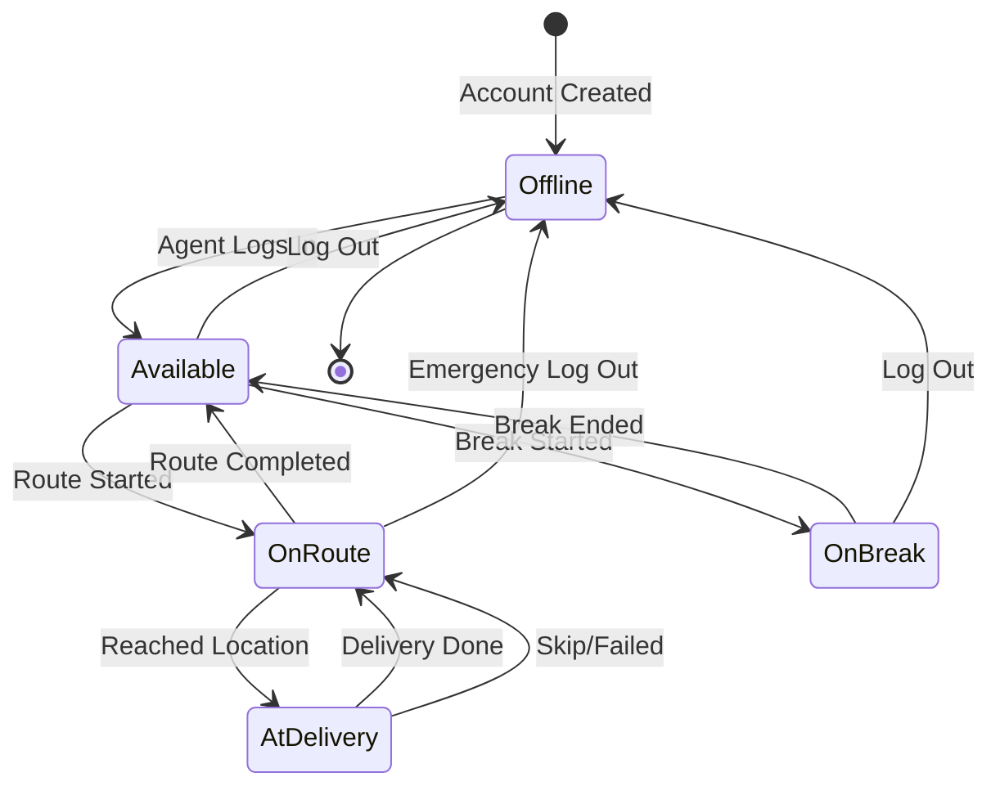

# State Machine Diagrams

## Overview
State machine diagrams showing object state transitions for key entities.

---

## Order State Machine

---

## Order Status Descriptions

| Status | Description |
|--------|-------------|
| **Pending** | Order created, awaiting payment confirmation |
| **Confirmed** | Payment received, awaiting vendor acceptance |
| **Processing** | Vendor accepted, preparing for shipment |
| **Packed** | Order packed, awaiting pickup |
| **Shipped** | Picked up by logistics partner |
| **InTransit** | In line haul transit between hubs |
| **AtHub** | Arrived at destination hub |
| **OutForDelivery** | With delivery agent for final delivery |
| **Delivered** | Successfully delivered to customer |
| **DeliveryFailed** | Delivery attempt unsuccessful |
| **RTOInitiated** | Return to origin initiated |
| **RTOInTransit** | Returning to vendor |
| **RTODelivered** | Returned to vendor |
| **Cancelled** | Order cancelled |
| **ReturnRequested** | Customer requested return |
| **ReturnApproved** | Return approved by vendor |
| **ReturnPickedUp** | Return pickup completed |
| **Returned** | Item returned to vendor |

---

## Payment State Machine

---

## Payment Status Transitions

| From | To | Trigger |
|------|-----|--------|
| Created | Pending | Customer initiates payment |
| Pending | Authorized | Gateway authorizes payment |
| Pending | Failed | Authorization fails |
| Pending | Expired | Payment timeout (15 min) |
| Authorized | Captured | Payment captured after order confirm |
| Authorized | Voided | Order cancelled before capture |
| Captured | PartiallyRefunded | Partial return processed |
| Captured | Refunded | Full refund processed |

---

## Shipment State Machine

---

## Vendor State Machine

---

## Vendor Order State Machine

---

## Return State Machine

---

## Cart State Machine

---

## Delivery Agent State Machine

