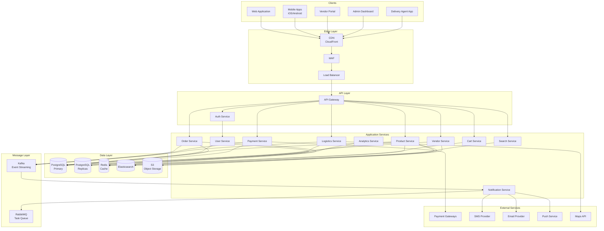
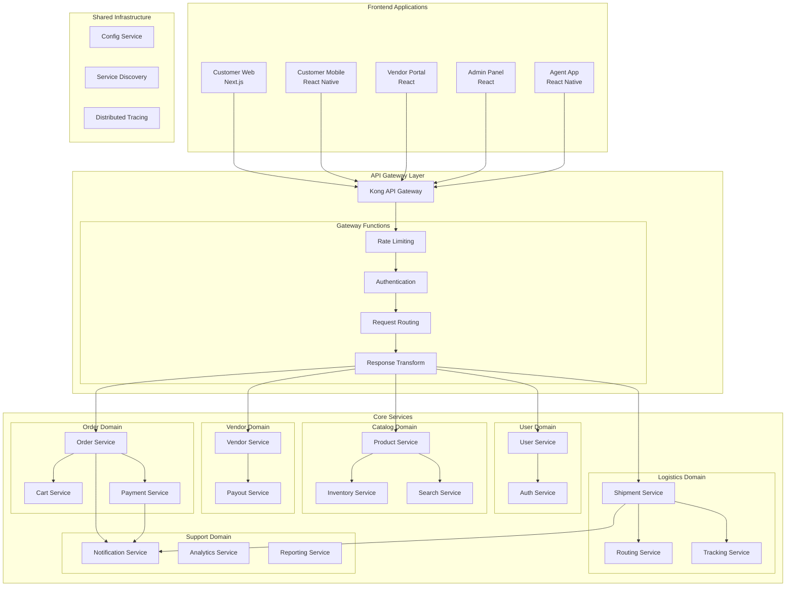
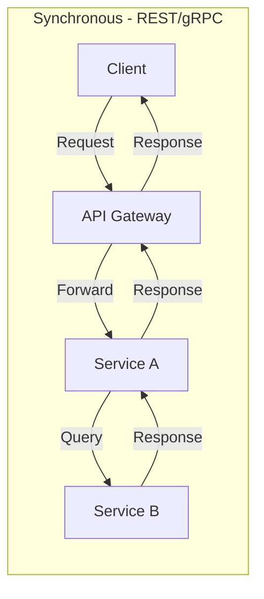
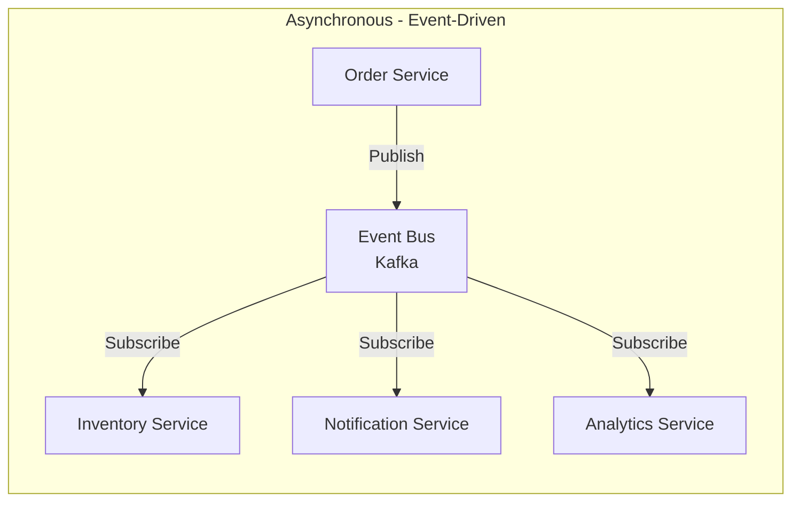
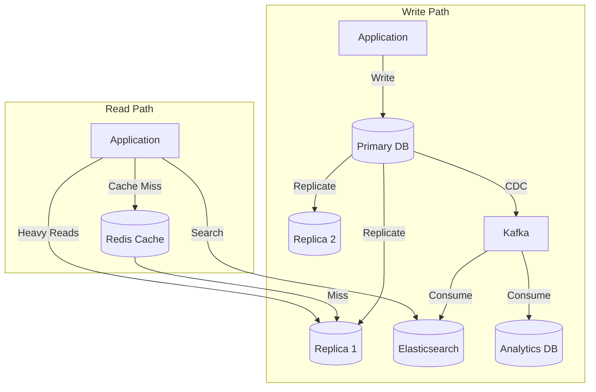
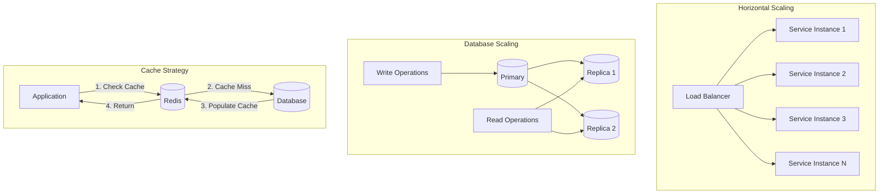
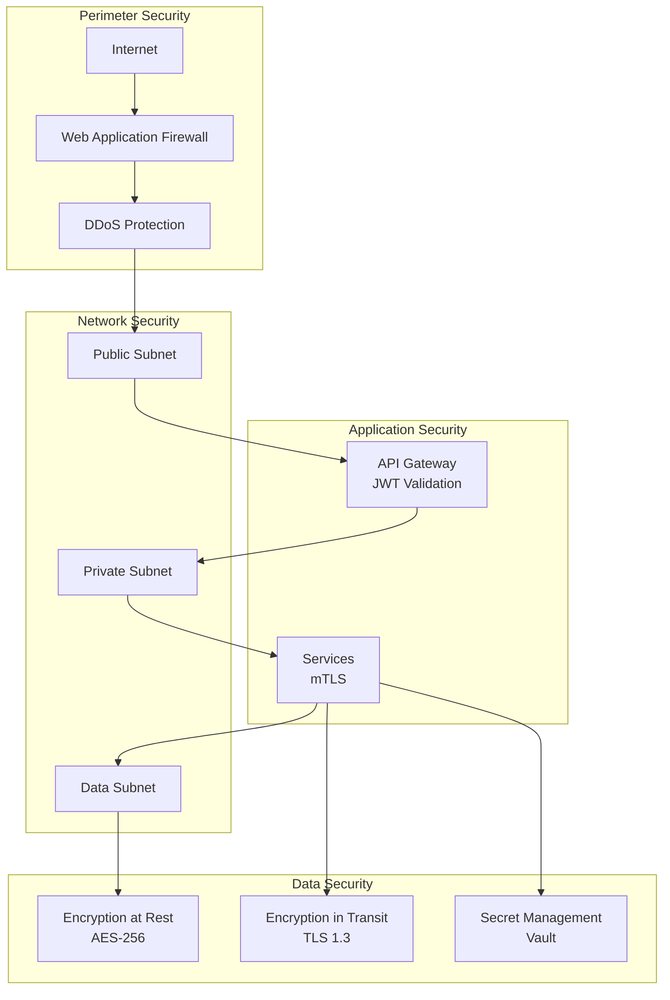
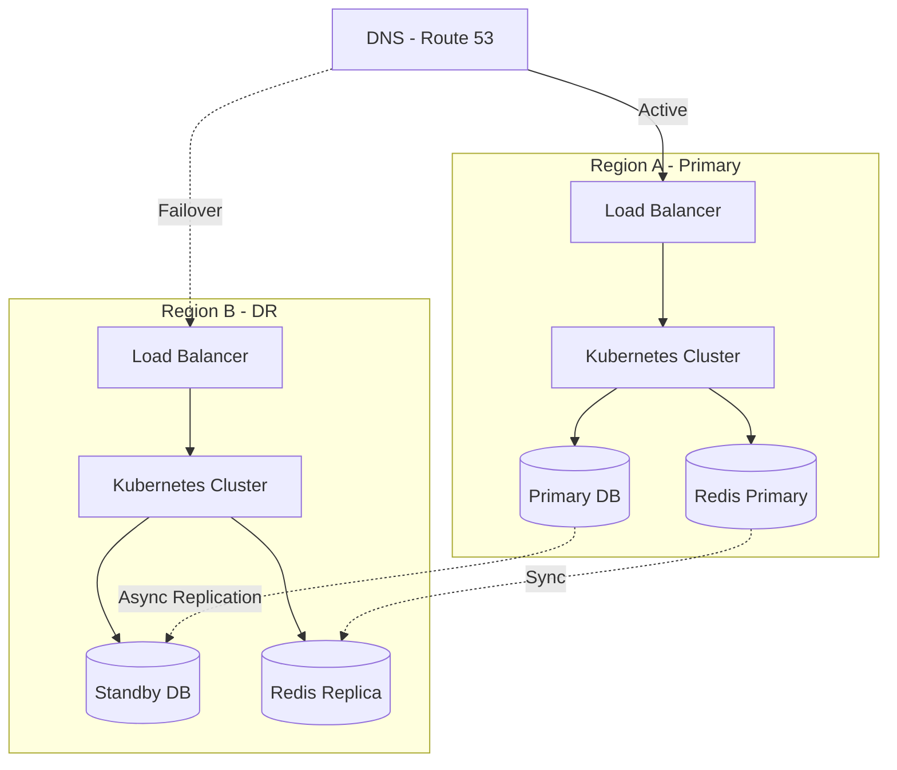

# High-Level Architecture Diagram

## Overview
This document presents the high-level architecture of the e-commerce platform, showing major components and their interactions.

---

## System Architecture Overview

---

## Microservices Architecture

---

## Service Communication Patterns

---

## Data Architecture

---

## Technology Stack

| Layer | Technology | Purpose |
|-------|------------|---------|
| **Frontend** | Next.js, React Native | Web and mobile apps |
| **API Gateway** | Kong / AWS API Gateway | Routing, auth, rate limiting |
| **Services** | Node.js / Python / Go | Business logic |
| **Database** | PostgreSQL | Primary data store |
| **Cache** | Redis | Session, cart, hot data |
| **Search** | Elasticsearch | Product search |
| **Message Queue** | Kafka, RabbitMQ | Event streaming, tasks |
| **Object Storage** | S3/GCS | Images, documents |
| **CDN** | CloudFront/Cloudflare | Static assets |
| **Container** | Docker, Kubernetes | Deployment |
| **Monitoring** | Prometheus, Grafana | Metrics |
| **Logging** | ELK Stack | Centralized logs |
| **Tracing** | Jaeger | Distributed tracing |

---

## Scalability Patterns

---

## Security Architecture

---

## High Availability Design

