# C4 Diagrams

## Overview
C4 (Context, Containers, Components, Code) diagrams provide a hierarchical way to describe architecture at different levels of abstraction.

---

## Level 1: System Context Diagram

```mermaid
graph TB
    Customer((Customer<br>👤))
    Vendor((Vendor<br>🏪))
    Admin((Admin<br>👨‍💼))
    Agent((Delivery Agent<br>🛵))
    
    subgraph "E-Commerce Platform"
        System[E-Commerce System<br>Enables online shopping,<br>vendor management, and<br>order fulfillment]
    end
    
    PaymentGW[Payment Gateway<br>📱 External System<br>Razorpay, Stripe]
    LogisticsPartner[Logistics Partner<br>🚚 External System<br>3PL Integration]
    NotificationSvc[Notification Services<br>📧 External System<br>SMS, Email, Push]
    MapsAPI[Maps Service<br>🗺️ External System<br>Google Maps]
    
    Customer -->|Browses products,<br>places orders,<br>tracks deliveries| System
    Vendor -->|Manages products,<br>fulfills orders,<br>views analytics| System
    Admin -->|Manages platform,<br>users, and settings| System
    Agent -->|Delivers orders,<br>captures POD| System
    
    System -->|Processes payments| PaymentGW
    System <-->|Creates shipments,<br>gets tracking| LogisticsPartner
    System -->|Sends notifications| NotificationSvc
    System -->|Gets directions,<br>calculates ETA| MapsAPI
    
    style System fill:#438DD5,color:#fff
    style PaymentGW fill:#999,color:#fff
    style LogisticsPartner fill:#999,color:#fff
    style NotificationSvc fill:#999,color:#fff
    style MapsAPI fill:#999,color:#fff
```

---

## Level 2: Container Diagram

```mermaid
graph TB
    Customer((Customer 👤))
    Vendor((Vendor 🏪))
    Admin((Admin 👨‍💼))
    Agent((Agent 🛵))
    
    subgraph "E-Commerce Platform"
        subgraph "Frontend Applications"
            WebApp[Customer Web App<br>Container: Next.js<br>Provides shopping experience]
            VendorPortal[Vendor Portal<br>Container: React<br>Product & order management]
            AdminDash[Admin Dashboard<br>Container: React<br>Platform management]
            AgentApp[Agent Mobile App<br>Container: React Native<br>Delivery management]
        end
        
        subgraph "API Layer"
            Gateway[API Gateway<br>Container: Kong<br>Routing, Auth, Rate Limiting]
        end
        
        subgraph "Microservices"
            UserSvc[User Service<br>Container: Node.js<br>Authentication & profiles]
            ProductSvc[Product Service<br>Container: Node.js<br>Catalog management]
            OrderSvc[Order Service<br>Container: Node.js<br>Order processing]
            PaymentSvc[Payment Service<br>Container: Node.js<br>Payment handling]
            LogSvc[Logistics Service<br>Container: Node.js<br>Shipping management]
            NotifSvc[Notification Service<br>Container: Python<br>Multi-channel notifications]
        end
        
        subgraph "Data Stores"
            DB[(PostgreSQL<br>Database<br>Primary data store)]
            Redis[(Redis<br>Cache<br>Sessions, caching)]
            Elastic[(Elasticsearch<br>Search Engine<br>Product search)]
            S3[(S3<br>Object Store<br>Images, files)]
        end
        
        subgraph "Message Bus"
            Kafka[Apache Kafka<br>Event Streaming<br>Async communication]
        end
    end
    
    PaymentGW[Payment Gateway]
    SMS[SMS Provider]
    Email[Email Provider]
    
    Customer --> WebApp
    Vendor --> VendorPortal
    Admin --> AdminDash
    Agent --> AgentApp
    
    WebApp --> Gateway
    VendorPortal --> Gateway
    AdminDash --> Gateway
    AgentApp --> Gateway
    
    Gateway --> UserSvc
    Gateway --> ProductSvc
    Gateway --> OrderSvc
    Gateway --> PaymentSvc
    Gateway --> LogSvc
    
    UserSvc --> DB
    ProductSvc --> DB
    OrderSvc --> DB
    PaymentSvc --> DB
    LogSvc --> DB
    
    UserSvc --> Redis
    ProductSvc --> Redis
    ProductSvc --> Elastic
    ProductSvc --> S3
    
    OrderSvc --> Kafka
    PaymentSvc --> Kafka
    LogSvc --> Kafka
    Kafka --> NotifSvc
    
    PaymentSvc --> PaymentGW
    NotifSvc --> SMS
    NotifSvc --> Email
    
    style WebApp fill:#438DD5,color:#fff
    style VendorPortal fill:#438DD5,color:#fff
    style AdminDash fill:#438DD5,color:#fff
    style AgentApp fill:#438DD5,color:#fff
    style Gateway fill:#438DD5,color:#fff
    style UserSvc fill:#438DD5,color:#fff
    style ProductSvc fill:#438DD5,color:#fff
    style OrderSvc fill:#438DD5,color:#fff
    style PaymentSvc fill:#438DD5,color:#fff
    style LogSvc fill:#438DD5,color:#fff
    style NotifSvc fill:#438DD5,color:#fff
```

---

## Level 3: Component Diagram - Order Service

---

## Level 3: Component Diagram - Logistics Service

---

## Level 3: Component Diagram - Payment Service

---

## Container Relationships Matrix

| Container | Depends On | Depended By |
|-----------|------------|-------------|
| **Customer Web App** | API Gateway | - |
| **Vendor Portal** | API Gateway | - |
| **Admin Dashboard** | API Gateway | - |
| **API Gateway** | All Services | All Frontends |
| **User Service** | PostgreSQL, Redis | Gateway, Order Service |
| **Product Service** | PostgreSQL, Elasticsearch, S3 | Gateway, Order Service |
| **Order Service** | PostgreSQL, Redis, Kafka | Gateway, Payment Service |
| **Payment Service** | PostgreSQL, Kafka, Payment Gateways | Order Service |
| **Logistics Service** | PostgreSQL, Kafka, Maps API | Order Service |
| **Notification Service** | Kafka, SMS/Email Providers | All Services |

---

## Deployment Context

