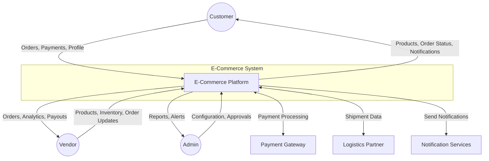
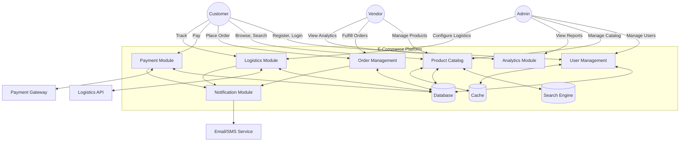
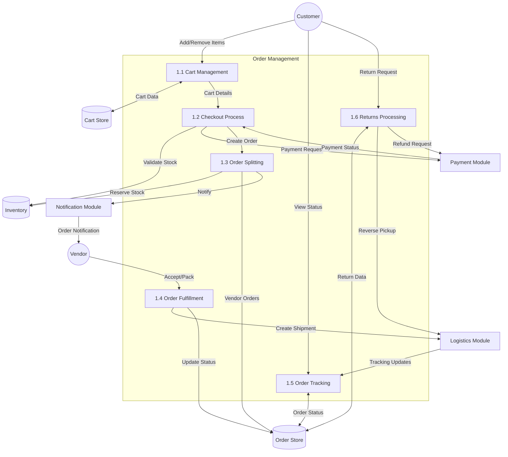
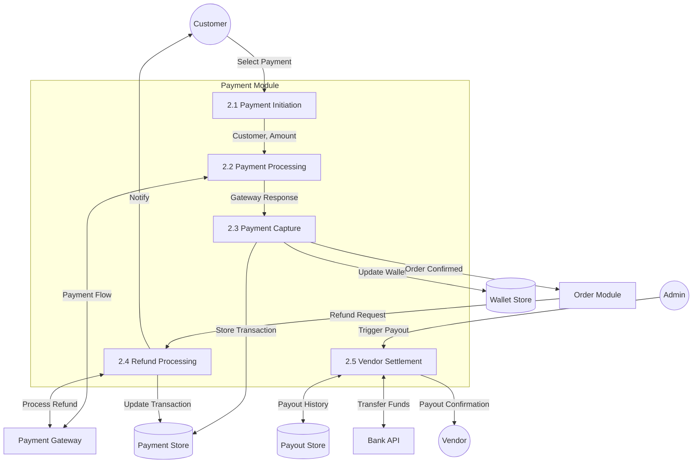
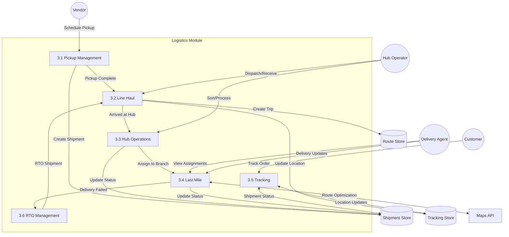
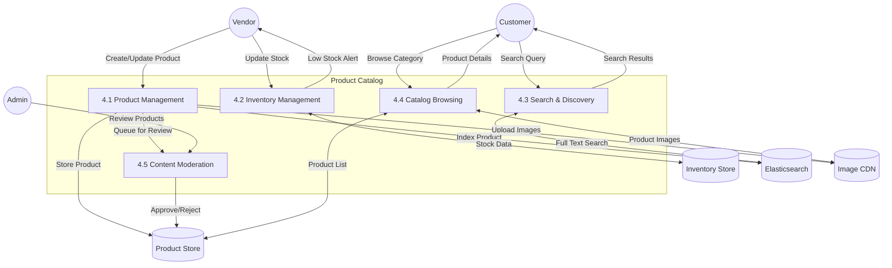
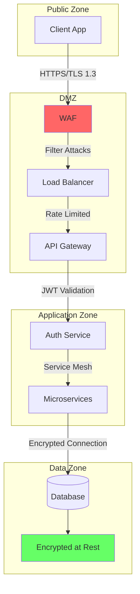

# Data Flow Diagrams

## Overview
Data Flow Diagrams (DFD) showing how data moves through the e-commerce system at different levels.

---

## Level 0: Context Diagram

---

## Level 1: Major Subsystems

---

## Level 2: Order Management DFD

---

## Level 2: Payment DFD

---

## Level 2: Logistics DFD

---

## Level 2: Product Catalog DFD

---

## Data Stores Summary

| Data Store | Description | Technology |
|------------|-------------|------------|
| User Store | User accounts, profiles, addresses | PostgreSQL |
| Product Store | Products, variants, categories, brands | PostgreSQL |
| Inventory Store | Stock levels per SKU per warehouse | PostgreSQL + Redis |
| Order Store | Orders, order items, status history | PostgreSQL |
| Cart Store | Shopping carts, cart items | Redis |
| Payment Store | Transactions, refunds, payouts | PostgreSQL |
| Shipment Store | Shipments, tracking, delivery | PostgreSQL |
| Session Store | User sessions, tokens | Redis |
| Search Index | Product search data | Elasticsearch |
| Cache | Frequently accessed data | Redis |
| File Storage | Images, documents | S3/GCS |
| Event Store | Async events, audit logs | Kafka/RabbitMQ |

---

## Data Flow Security

