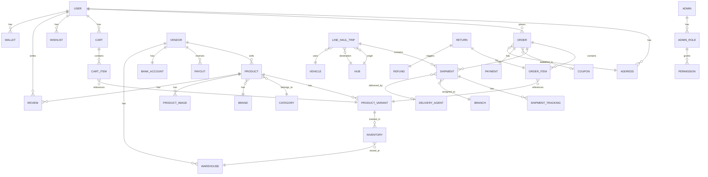
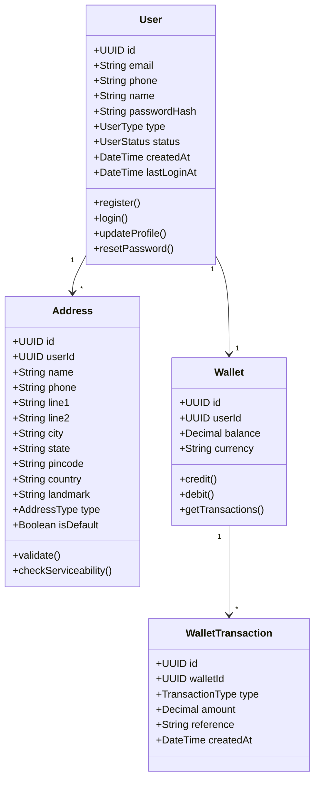
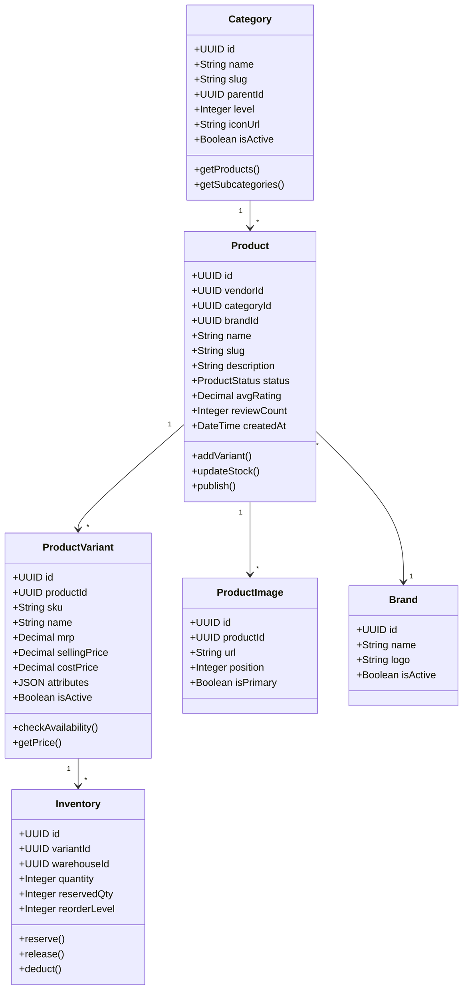
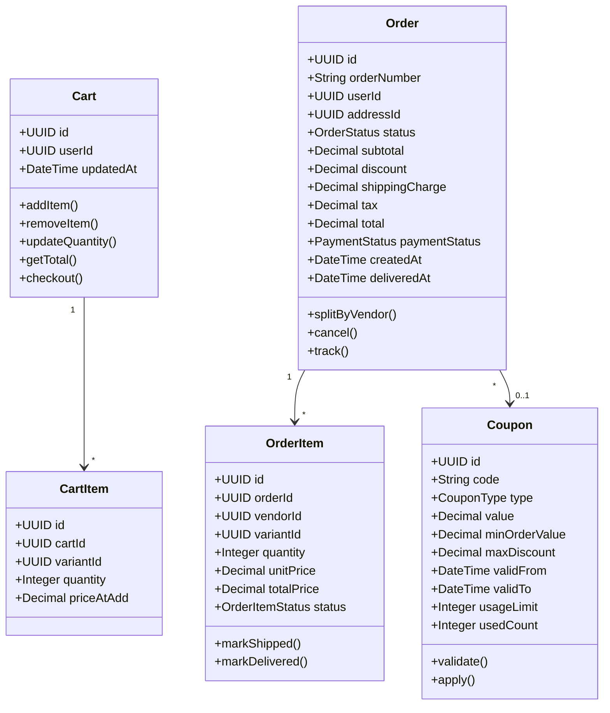
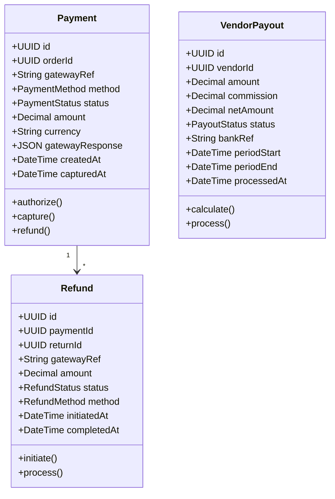
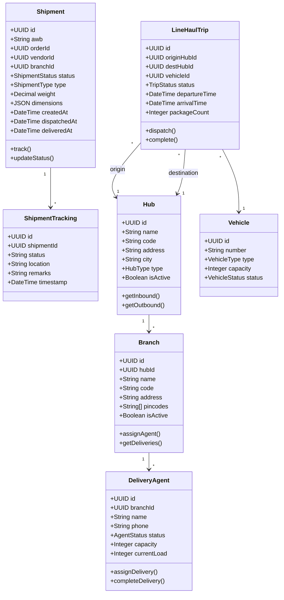
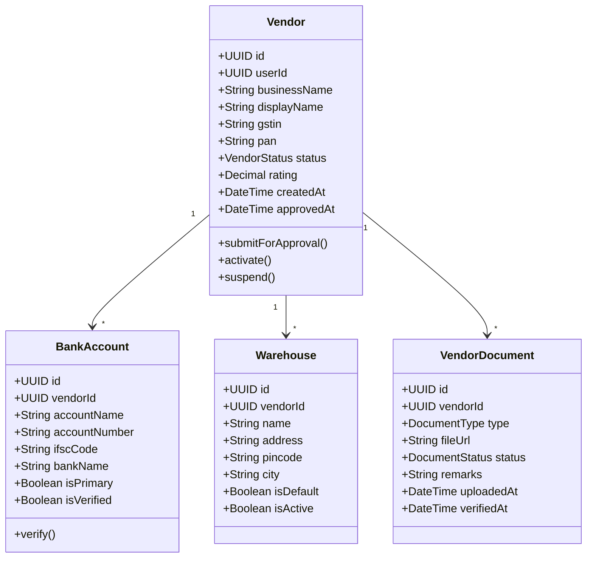
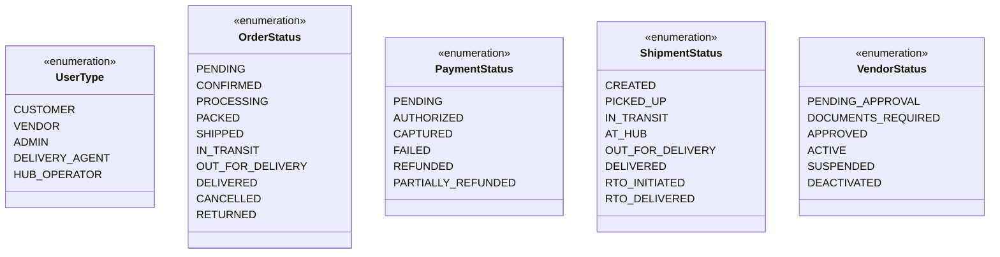

# Domain Model

## Overview
The Domain Model shows the key business entities and their relationships in the e-commerce system.

---

## Complete Domain Model

---

## User Domain

---

## Product Domain

---

## Order Domain

---

## Payment Domain

---

## Logistics Domain

---

## Vendor Domain

---

## Enumeration Types

