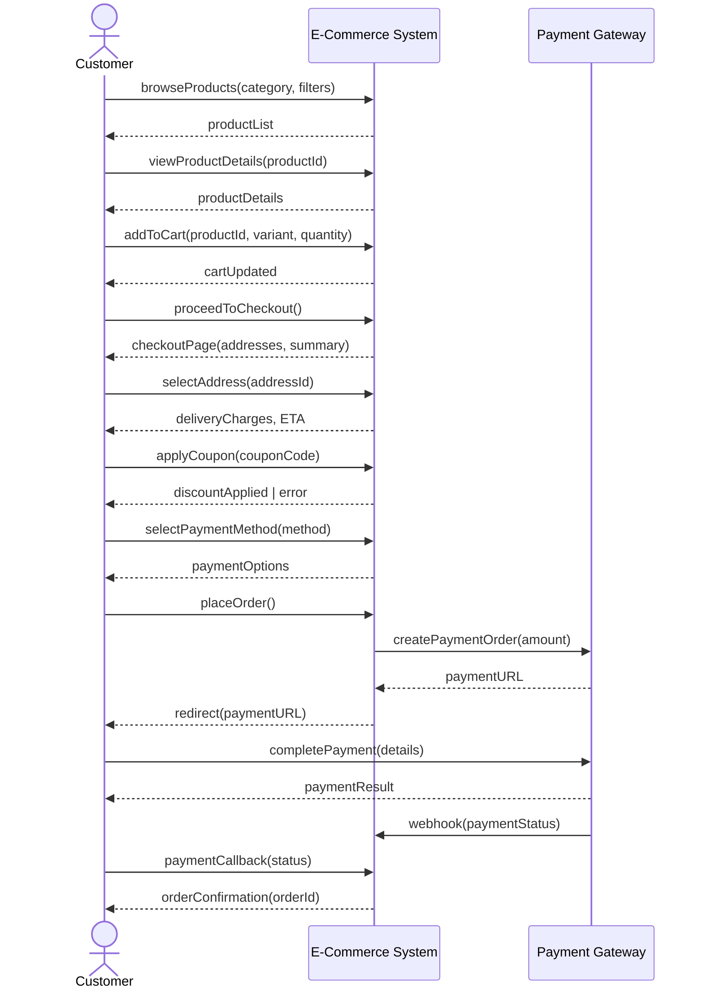
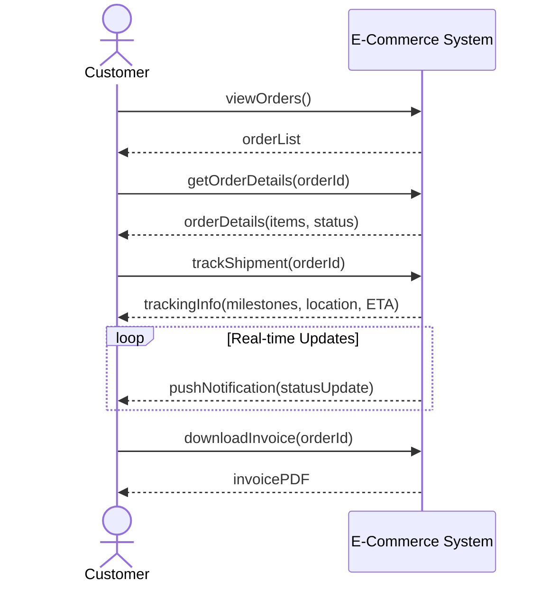
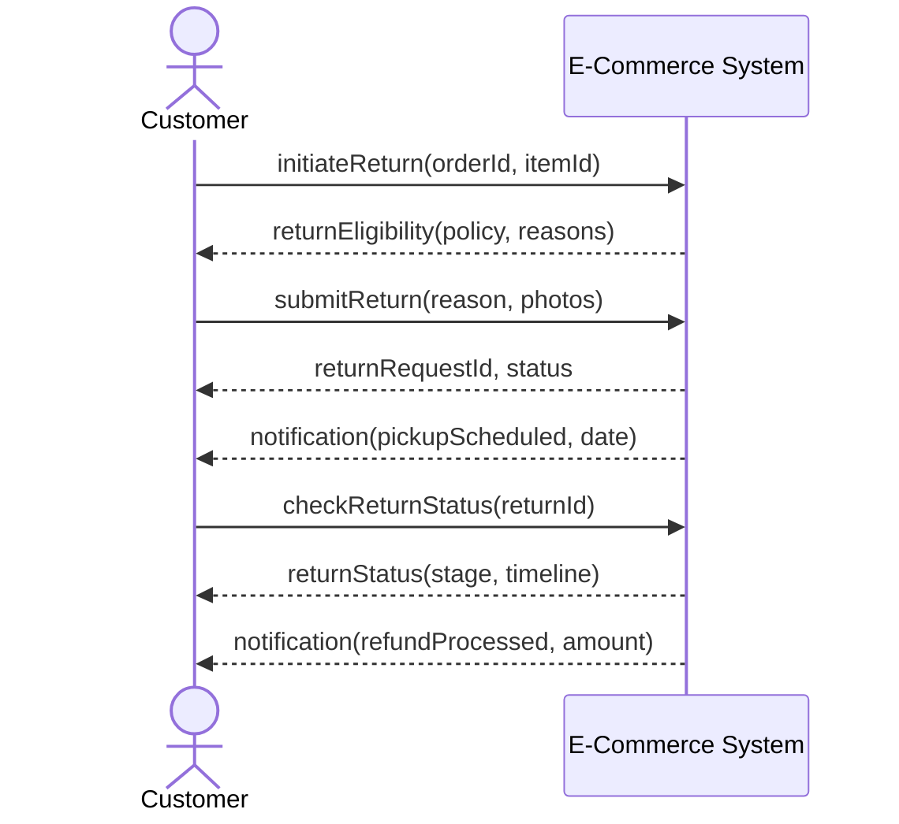
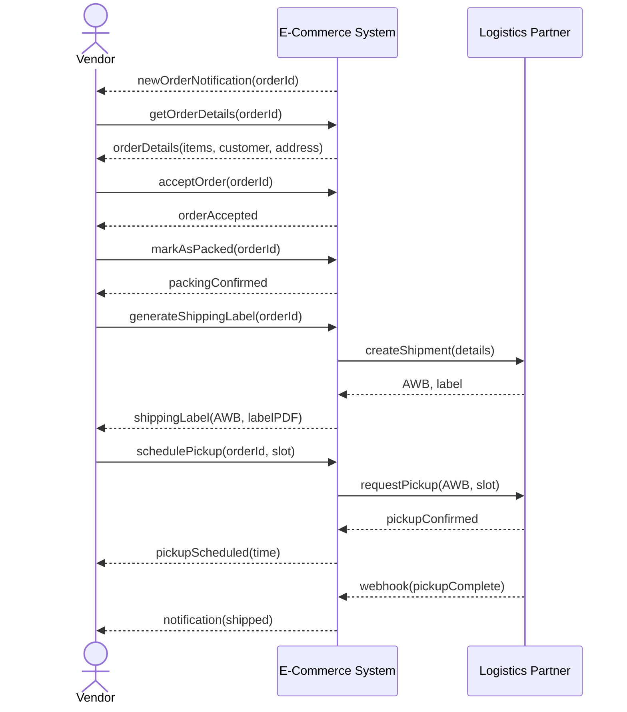
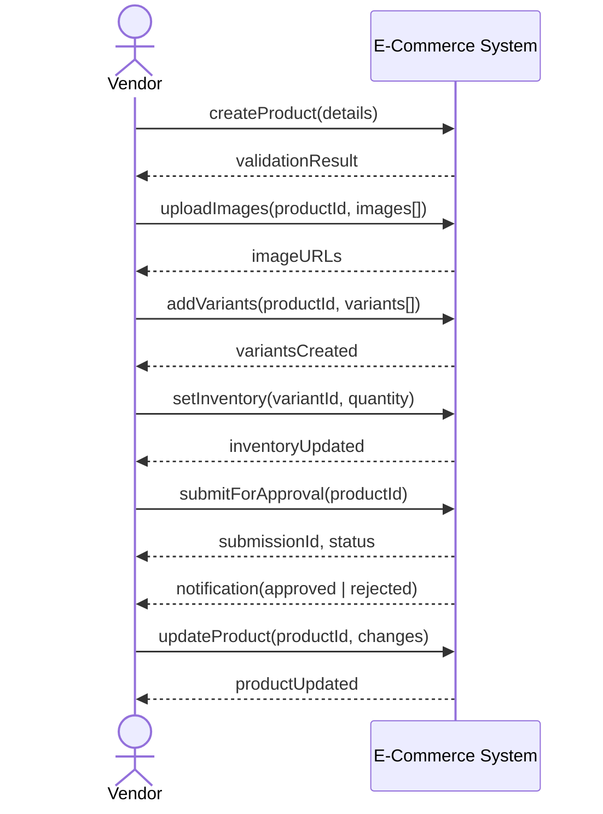
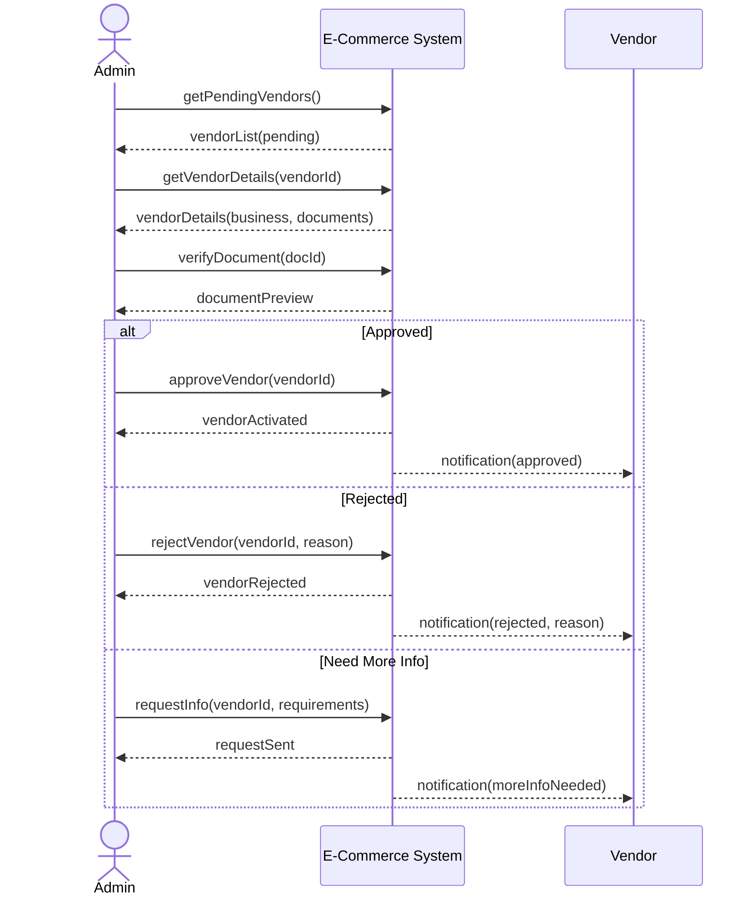
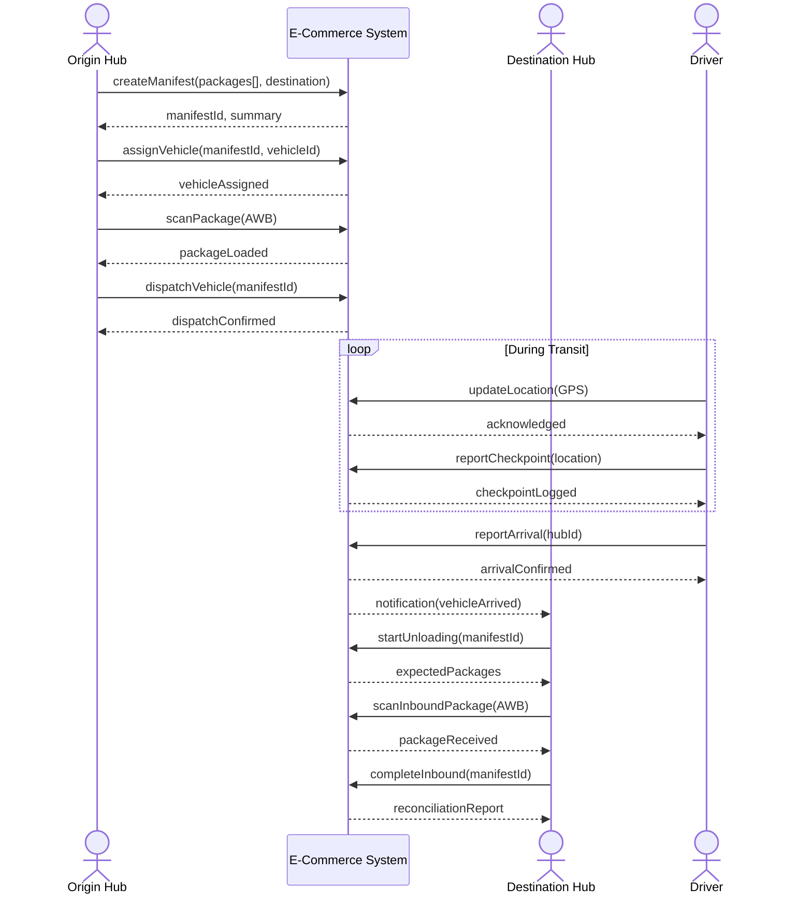
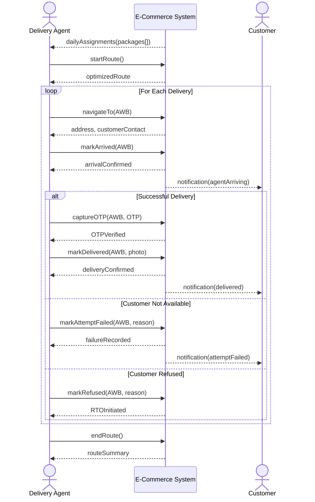
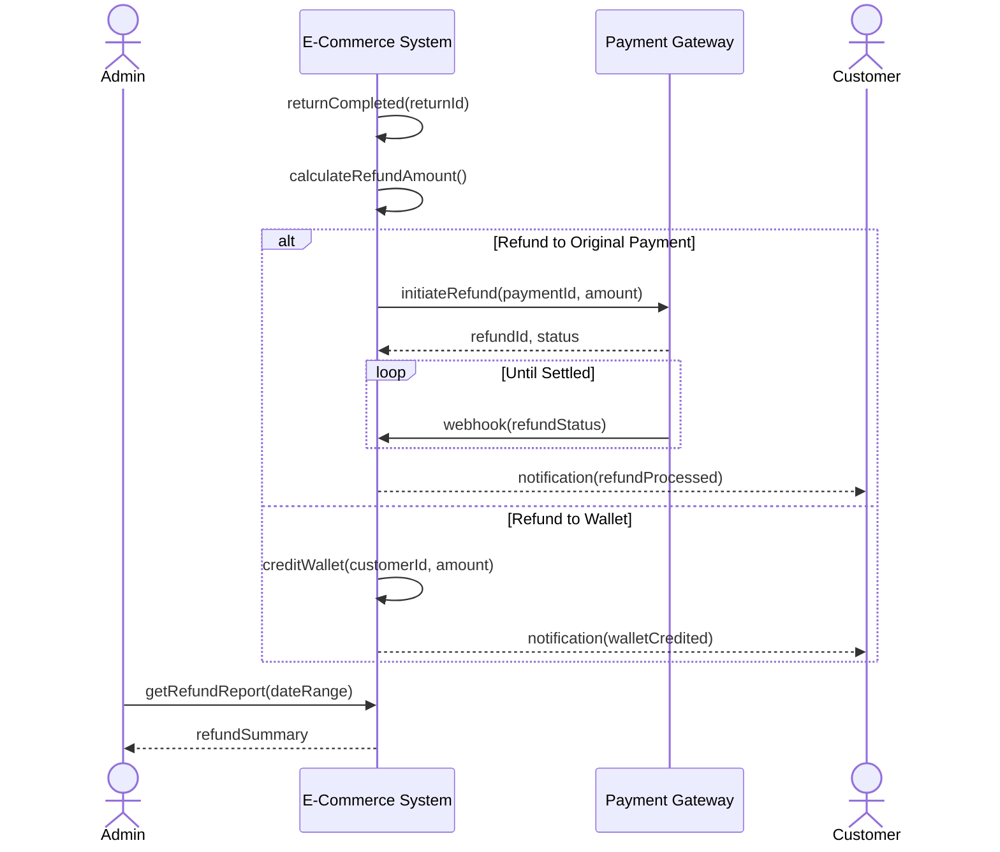

# System Sequence Diagrams

## Overview
System Sequence Diagrams (SSD) show black-box interactions between actors and the system, treating the system as a single entity.

---

## Customer: Place Order Sequence

---

## Customer: Track Order Sequence

---

## Customer: Return Request Sequence

---

## Vendor: Order Fulfillment Sequence

---

## Vendor: Product Management Sequence

---

## Admin: Vendor Approval Sequence

---

## Logistics: Line Haul Sequence

---

## Logistics: Last Mile Delivery Sequence

---

## Payment: Refund Processing Sequence

