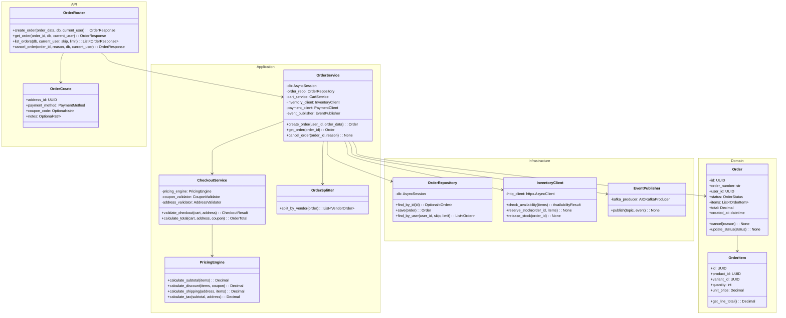
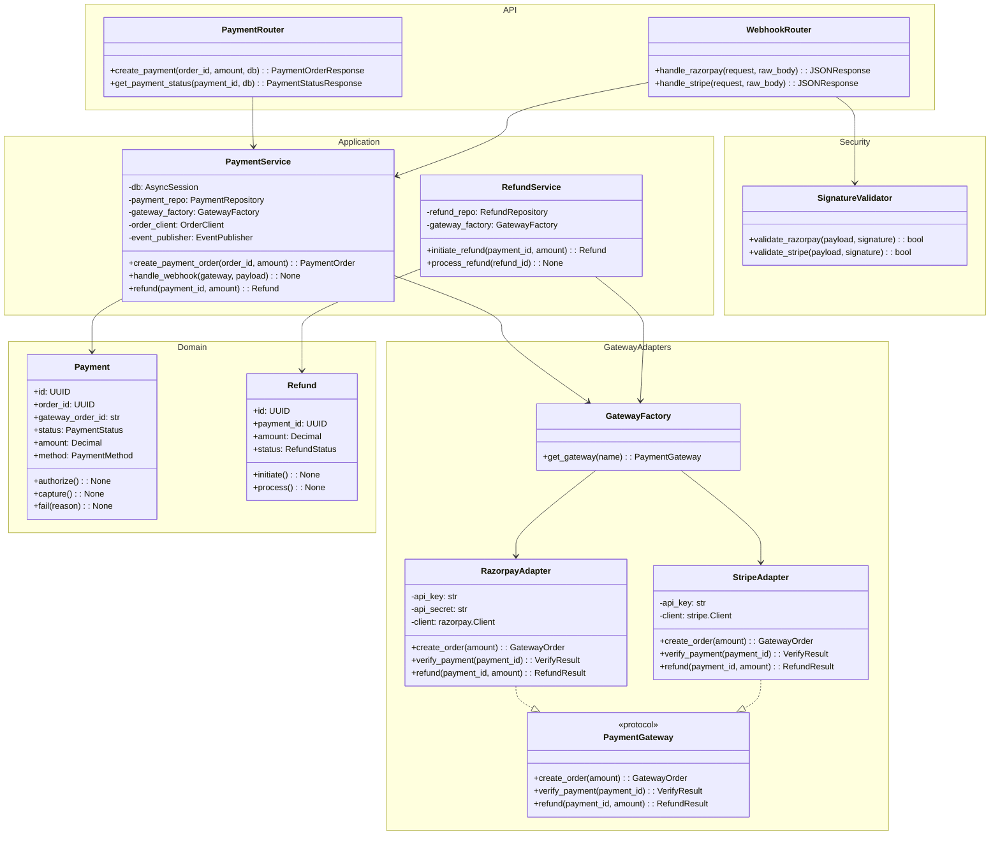
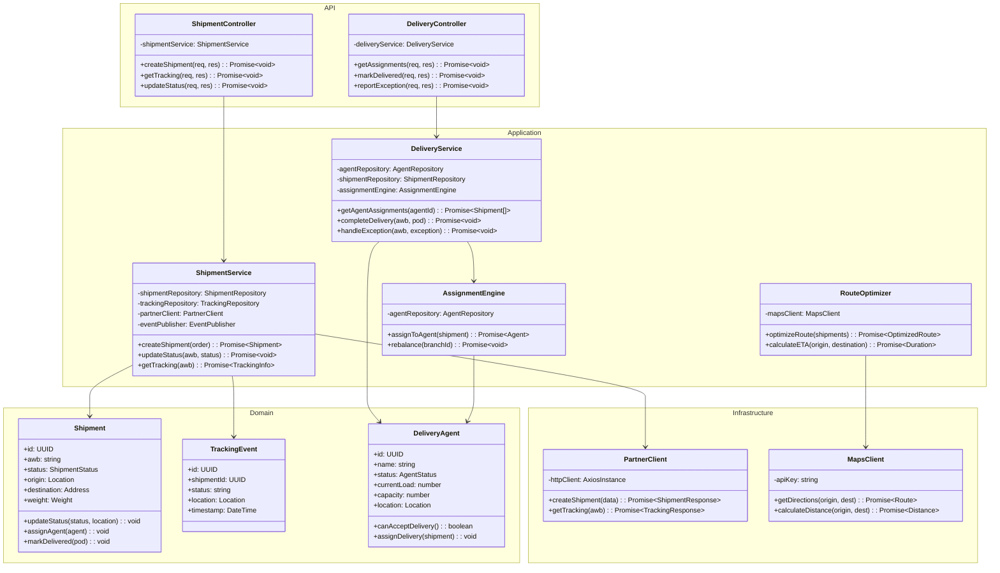
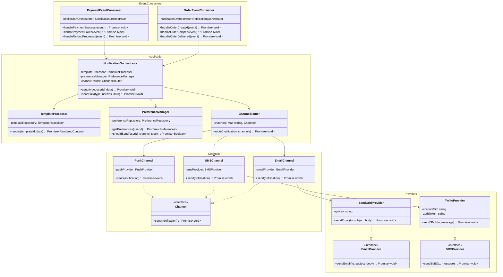

# C4 Code Diagram

## Overview
C4 Code diagrams showing class-level details for key components. This is the lowest level of the C4 model.

---

## Order Service - Code Level Diagram


```

---

## Payment Service - Code Level Diagram



---

## Logistics Service - Code Level Diagram



---

## Notification Service - Code Level Diagram



---

## Code Organization Summary

| Layer | Responsibility | Examples |
|-------|---------------|----------|
| **API** | HTTP handling, validation, routing | Controllers, DTOs, Middleware |
| **Application** | Business logic orchestration | Services, Use Cases |
| **Domain** | Core business entities and rules | Entities, Value Objects, Domain Events |
| **Infrastructure** | External integrations, persistence | Repositories, API Clients, Message Publishers |

---

## Design Patterns Used

| Pattern | Purpose | Location |
|---------|---------|----------|
| **Repository** | Abstract data access | Infrastructure layer |
| **Factory** | Create gateway instances | Payment gateway selection |
| **Adapter** | Integrate external services | API clients, providers |
| **Strategy** | Interchangeable algorithms | Pricing, routing |
| **Observer** | Event-driven communication | Kafka event publishing |
| **Decorator** | Add cross-cutting concerns | Logging, caching |
| **DI/IoC** | Dependency management | All layers |
