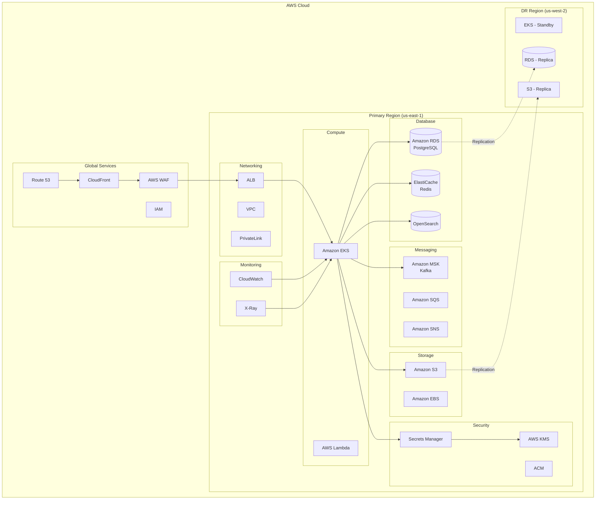
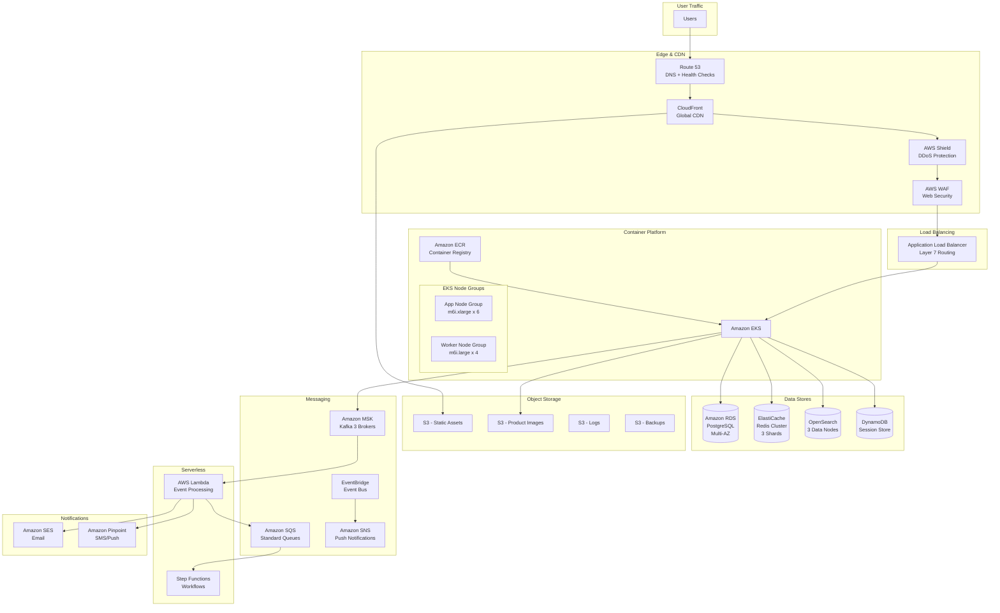
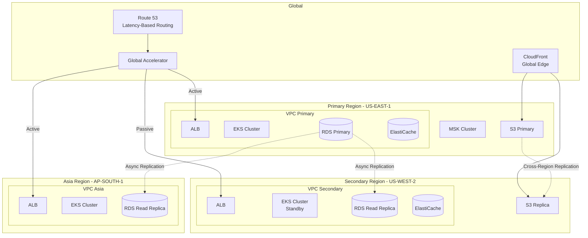
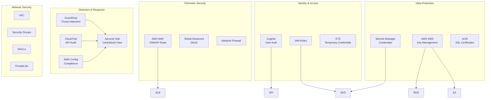
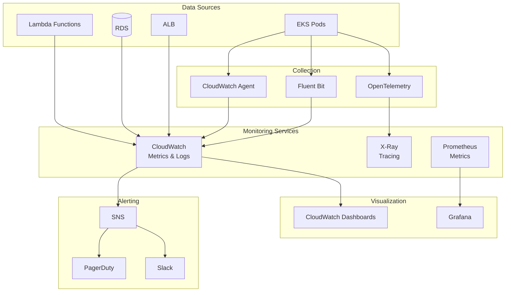
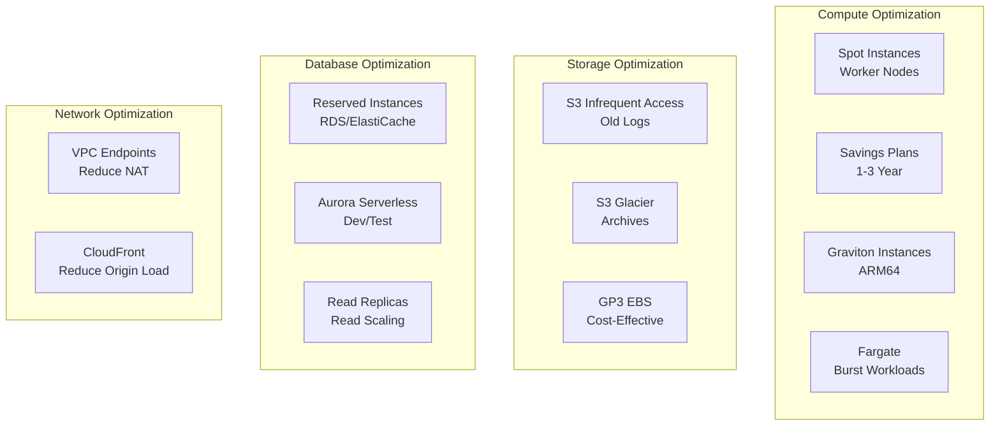

# Cloud Architecture Diagram

## Overview
Cloud architecture design for the e-commerce platform on AWS.

---

## AWS Architecture Overview

---

## Detailed AWS Service Architecture

---

## Multi-Region Architecture

---

## Security Architecture

---

## Monitoring & Observability

---

## Cost Optimization Architecture

---

## AWS Services Summary

| Category | Service | Purpose |
|----------|---------|---------|
| **Compute** | EKS | Container orchestration |
| | Lambda | Event-driven functions |
| | Fargate | Serverless containers |
| **Storage** | S3 | Object storage |
| | EBS | Block storage |
| **Database** | RDS PostgreSQL | Primary database |
| | ElastiCache Redis | Caching |
| | OpenSearch | Full-text search |
| | DynamoDB | Session store |
| **Messaging** | MSK (Kafka) | Event streaming |
| | SQS | Message queues |
| | SNS | Pub/sub notifications |
| **Networking** | VPC | Network isolation |
| | ALB | Load balancing |
| | CloudFront | CDN |
| | Route 53 | DNS |
| **Security** | WAF | Web firewall |
| | KMS | Encryption |
| | Secrets Manager | Credentials |
| | IAM | Access control |
| **Monitoring** | CloudWatch | Metrics & logs |
| | X-Ray | Distributed tracing |

---

## Estimated Monthly Costs

| Component | Specification | Est. Monthly Cost |
|-----------|---------------|-------------------|
| EKS Cluster | Control plane + nodes | $1,500 |
| EC2 Instances | 10 x m6i.xlarge | $3,500 |
| RDS PostgreSQL | db.r6g.2xlarge Multi-AZ | $2,000 |
| ElastiCache | 3-shard cluster | $1,200 |
| OpenSearch | 3-node cluster | $1,500 |
| MSK | 3-broker cluster | $1,800 |
| S3 | 5 TB storage | $115 |
| CloudFront | 10 TB transfer | $850 |
| Data Transfer | 50 TB | $4,500 |
| **Total** | | **~$17,000/month** |

> Note: Costs are estimates and will vary based on actual usage.
