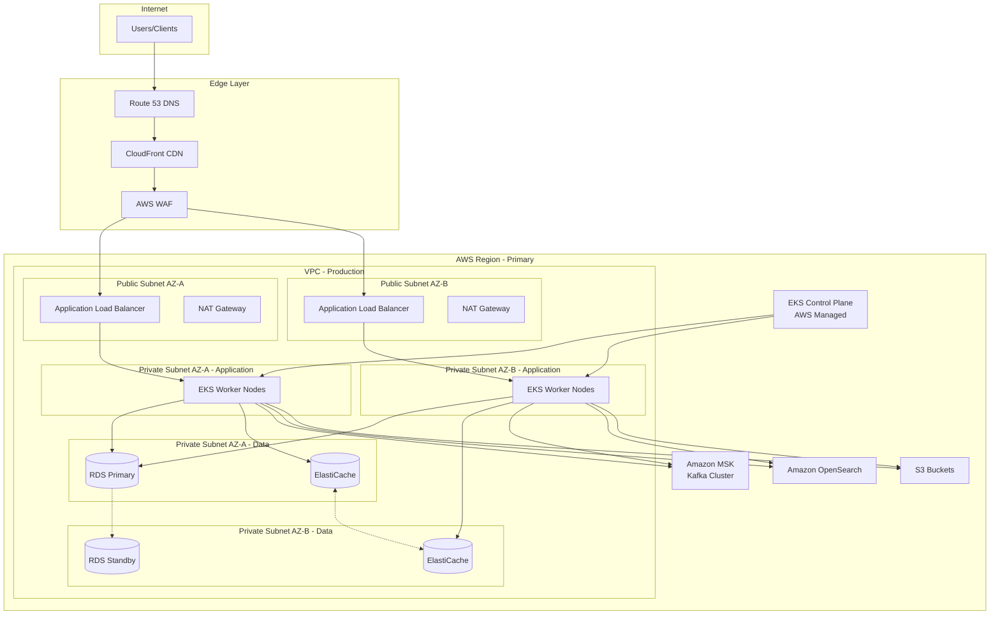
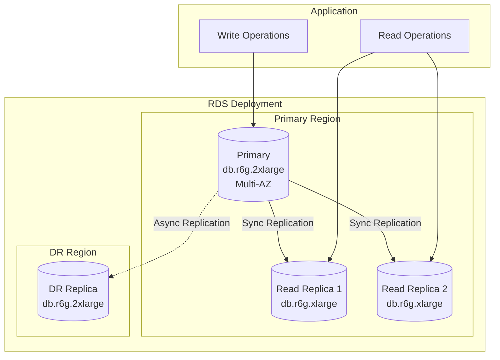
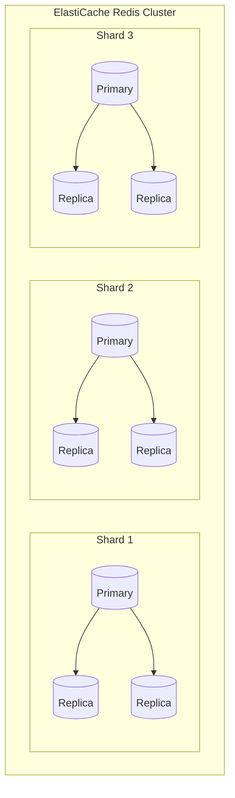
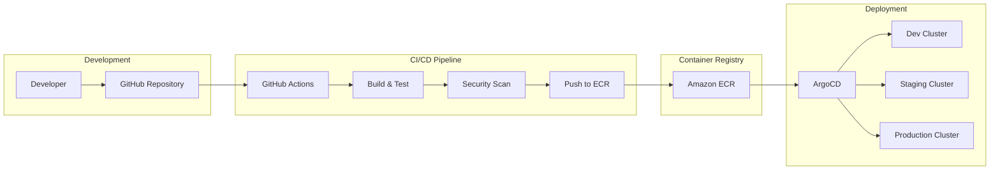

# Deployment Diagram

## Overview
Deployment diagrams showing the mapping of software components to hardware/infrastructure.

---

## Production Deployment Architecture



---

## Kubernetes Deployment

```mermaid
graph TB
    subgraph "EKS Cluster"
        subgraph "Ingress"
            Ingress[NGINX Ingress Controller]
        end
        
        subgraph "API Layer Namespace"
            Gateway[Kong API Gateway<br>3 replicas]
        end
        
        subgraph "Services Namespace"
            subgraph "User Domain"
                AuthSvc[Auth Service<br>3 replicas]
                UserSvc[User Service<br>3 replicas]
            end
            
            subgraph "Catalog Domain"
                ProductSvc[Product Service<br>5 replicas]
                InventorySvc[Inventory Service<br>3 replicas]
                SearchSvc[Search Service<br>3 replicas]
            end
            
            subgraph "Order Domain"
                CartSvc[Cart Service<br>3 replicas]
                OrderSvc[Order Service<br>5 replicas]
                CheckoutSvc[Checkout Service<br>3 replicas]
            end
            
            subgraph "Payment Domain"
                PaymentSvc[Payment Service<br>3 replicas]
                PayoutSvc[Payout Service<br>2 replicas]
            end
            
            subgraph "Logistics Domain"
                ShipmentSvc[Shipment Service<br>3 replicas]
                TrackingSvc[Tracking Service<br>3 replicas]
            end
            
            subgraph "Support Domain"
                NotifSvc[Notification Service<br>3 replicas]
                AnalyticsSvc[Analytics Service<br>2 replicas]
            end
        end
        
        subgraph "Workers Namespace"
            OrderWorker[Order Worker<br>2 replicas]
            NotifWorker[Notification Worker<br>3 replicas]
            AnalyticsWorker[Analytics Worker<br>2 replicas]
        end
        
        subgraph "Monitoring Namespace"
            Prometheus[Prometheus]
            Grafana[Grafana]
            Jaeger[Jaeger]
        end
    end
    
    Ingress --> Gateway
    Gateway --> AuthSvc
    Gateway --> UserSvc
    Gateway --> ProductSvc
    Gateway --> OrderSvc
    Gateway --> PaymentSvc
    Gateway --> ShipmentSvc
```

---

## Service Deployment Specifications

### Deployment YAML Example

```yaml
apiVersion: apps/v1
kind: Deployment
metadata:
  name: order-service
  namespace: services
spec:
  replicas: 5
  selector:
    matchLabels:
      app: order-service
  template:
    metadata:
      labels:
        app: order-service
    spec:
      containers:
      - name: order-service
        image: ecr.aws/ecommerce/order-service:v1.2.3
        ports:
        - containerPort: 3000
        resources:
          requests:
            memory: "512Mi"
            cpu: "250m"
          limits:
            memory: "1Gi"
            cpu: "500m"
        livenessProbe:
          httpGet:
            path: /health
            port: 3000
          initialDelaySeconds: 30
          periodSeconds: 10
        readinessProbe:
          httpGet:
            path: /ready
            port: 3000
          initialDelaySeconds: 5
          periodSeconds: 5
        env:
        - name: DATABASE_URL
          valueFrom:
            secretKeyRef:
              name: db-credentials
              key: url
        - name: REDIS_URL
          valueFrom:
            configMapKeyRef:
              name: service-config
              key: redis-url
```

---

## Deployment Environment Matrix

| Service | Dev | Staging | Production |
|---------|-----|---------|------------|
| Auth Service | 1 replica | 2 replicas | 3 replicas |
| User Service | 1 replica | 2 replicas | 3 replicas |
| Product Service | 1 replica | 2 replicas | 5 replicas |
| Inventory Service | 1 replica | 2 replicas | 3 replicas |
| Cart Service | 1 replica | 2 replicas | 3 replicas |
| Order Service | 1 replica | 2 replicas | 5 replicas |
| Payment Service | 1 replica | 2 replicas | 3 replicas |
| Shipment Service | 1 replica | 2 replicas | 3 replicas |
| Notification Service | 1 replica | 2 replicas | 3 replicas |

---

## Database Deployment



---

## Redis Cluster Deployment



---

## Container Registry & CI/CD



---

## Resource Allocation

| Component | Instance Type | vCPU | Memory | Storage |
|-----------|---------------|------|--------|---------|
| EKS Worker (App) | m6i.xlarge | 4 | 16 GB | 100 GB |
| EKS Worker (Workers) | m6i.large | 2 | 8 GB | 50 GB |
| RDS Primary | db.r6g.2xlarge | 8 | 64 GB | 1 TB |
| RDS Replica | db.r6g.xlarge | 4 | 32 GB | 1 TB |
| ElastiCache | cache.r6g.xlarge | 4 | 26 GB | - |
| OpenSearch | r6g.xlarge.search | 4 | 32 GB | 500 GB |
| MSK Broker | kafka.m5.xlarge | 4 | 16 GB | 1 TB |
