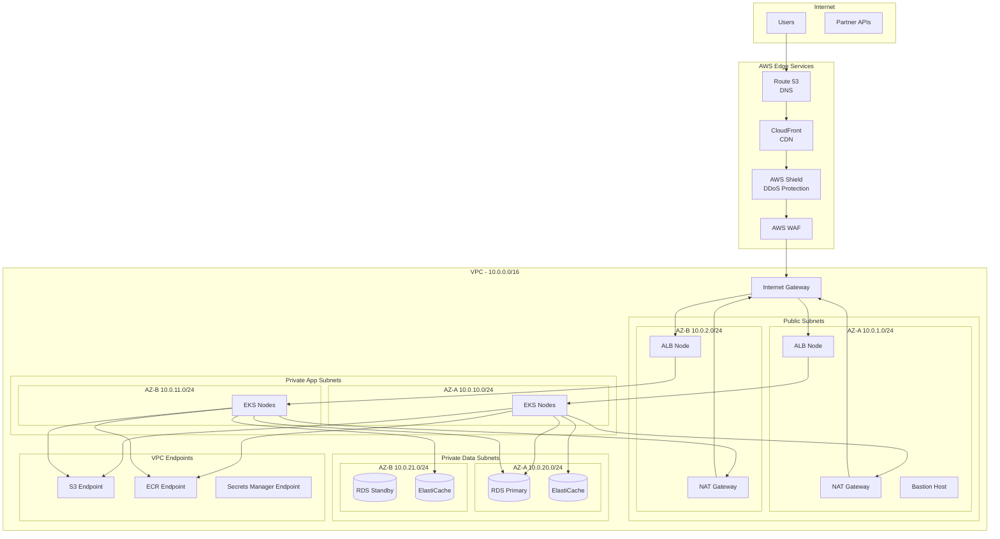
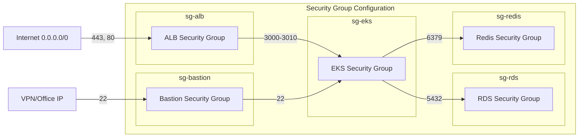
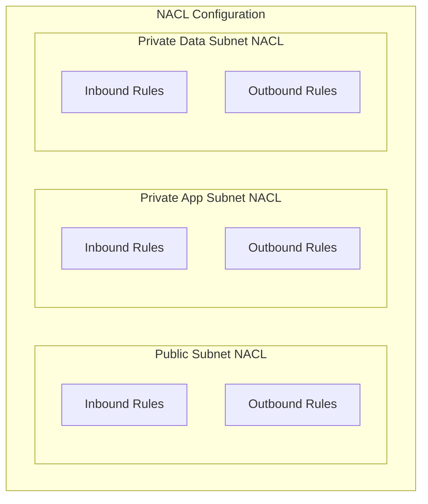
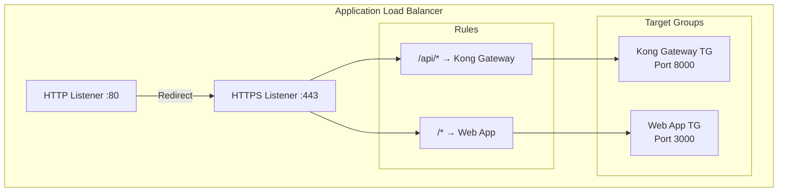
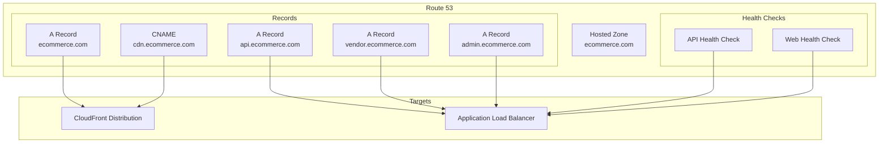
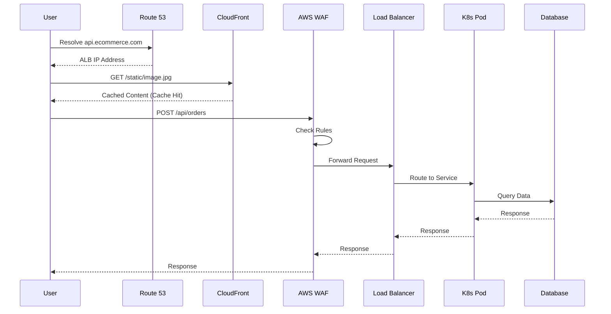
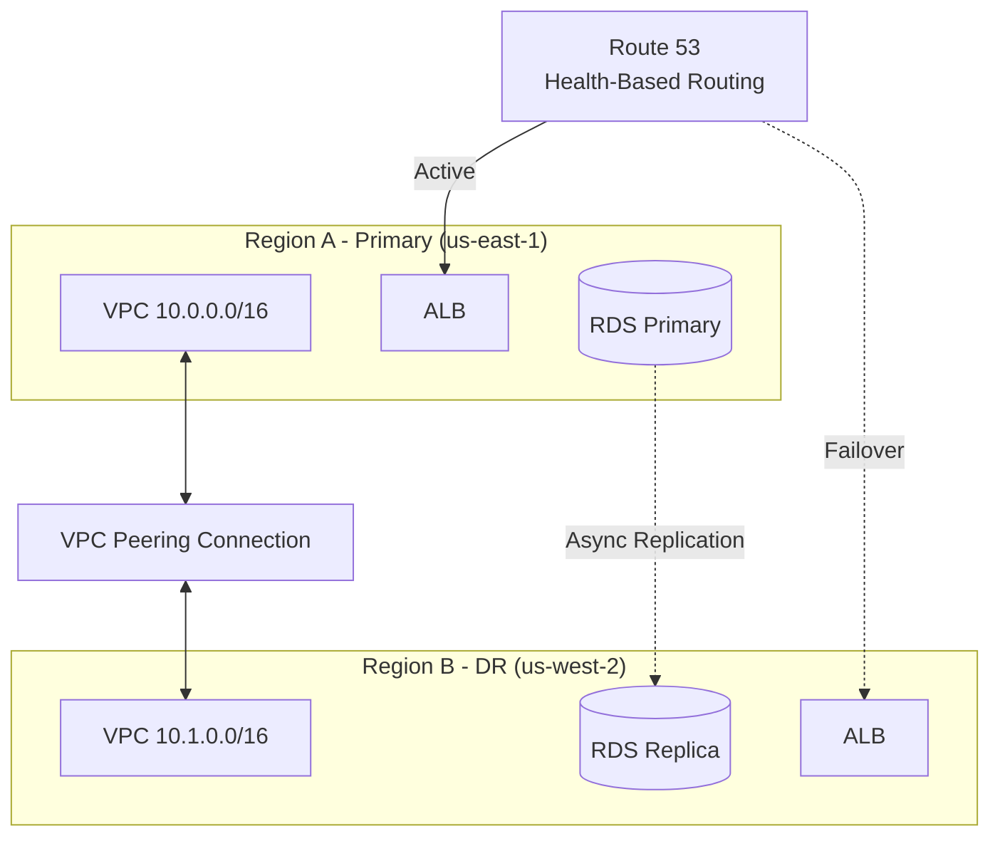

# Network / Infrastructure Diagram

## Overview
Network topology and infrastructure layout for the e-commerce platform.

---

## Network Architecture Overview

---

## Subnet Design

| Subnet | CIDR | Type | AZ | Purpose |
|--------|------|------|-----|---------|
| public-a | 10.0.1.0/24 | Public | AZ-A | ALB, NAT, Bastion |
| public-b | 10.0.2.0/24 | Public | AZ-B | ALB, NAT |
| private-app-a | 10.0.10.0/24 | Private | AZ-A | EKS Workers |
| private-app-b | 10.0.11.0/24 | Private | AZ-B | EKS Workers |
| private-data-a | 10.0.20.0/24 | Private | AZ-A | RDS, ElastiCache |
| private-data-b | 10.0.21.0/24 | Private | AZ-B | RDS, ElastiCache |

---

## Security Groups

### Security Group Rules

| Security Group | Type | Port | Source | Description |
|----------------|------|------|--------|-------------|
| sg-alb | Inbound | 443 | 0.0.0.0/0 | HTTPS from internet |
| sg-alb | Inbound | 80 | 0.0.0.0/0 | HTTP redirect |
| sg-eks | Inbound | 3000-3010 | sg-alb | From ALB |
| sg-eks | Inbound | 443 | EKS Control Plane | Kubernetes API |
| sg-rds | Inbound | 5432 | sg-eks | PostgreSQL from app |
| sg-redis | Inbound | 6379 | sg-eks | Redis from app |
| sg-bastion | Inbound | 22 | Office IP | SSH access |

---

## Network ACLs

| NACL | Rule | Type | Port | Source/Dest | Action |
|------|------|------|------|-------------|--------|
| Public | 100 | Inbound | 443 | 0.0.0.0/0 | Allow |
| Public | 110 | Inbound | 80 | 0.0.0.0/0 | Allow |
| Public | 120 | Inbound | 1024-65535 | 0.0.0.0/0 | Allow |
| Private-App | 100 | Inbound | 3000-3010 | 10.0.0.0/16 | Allow |
| Private-Data | 100 | Inbound | 5432 | 10.0.10.0/23 | Allow |
| Private-Data | 110 | Inbound | 6379 | 10.0.10.0/23 | Allow |

---

## Load Balancer Configuration

---

## VPC Endpoints

| Endpoint | Type | Service | Purpose |
|----------|------|---------|---------|
| S3 Endpoint | Gateway | com.amazonaws.region.s3 | S3 access without NAT |
| ECR Endpoint | Interface | com.amazonaws.region.ecr.api | Docker image pull |
| ECR DKR | Interface | com.amazonaws.region.ecr.dkr | Docker pull |
| Secrets Manager | Interface | com.amazonaws.region.secretsmanager | Secrets access |
| CloudWatch | Interface | com.amazonaws.region.logs | Log shipping |
| STS | Interface | com.amazonaws.region.sts | IAM auth |

---

## DNS Configuration

---

## Traffic Flow Diagram

---

## Cross-Region Network

---

## Bandwidth & Latency Requirements

| Connection | Bandwidth | Latency Target | SLA |
|------------|-----------|----------------|-----|
| User → CDN | Unlimited | < 50ms | 99.9% |
| CDN → ALB | 10 Gbps | < 10ms | 99.95% |
| ALB → EKS | 25 Gbps | < 5ms | 99.95% |
| EKS → RDS | 10 Gbps | < 2ms | 99.95% |
| EKS → Redis | 10 Gbps | < 1ms | 99.95% |
| Cross-Region | 1 Gbps | < 100ms | 99.9% |
